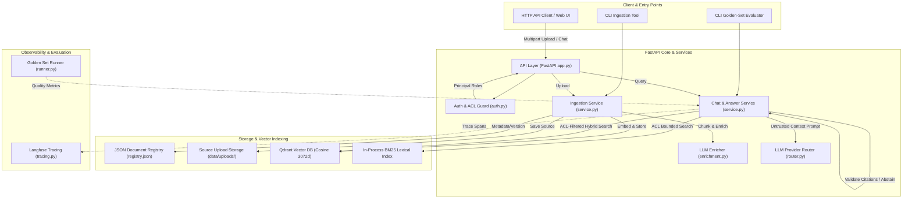
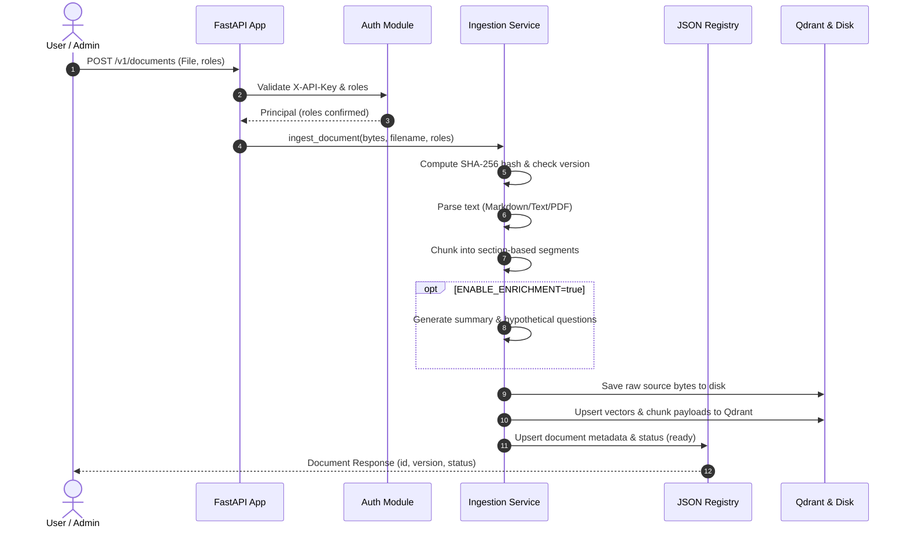
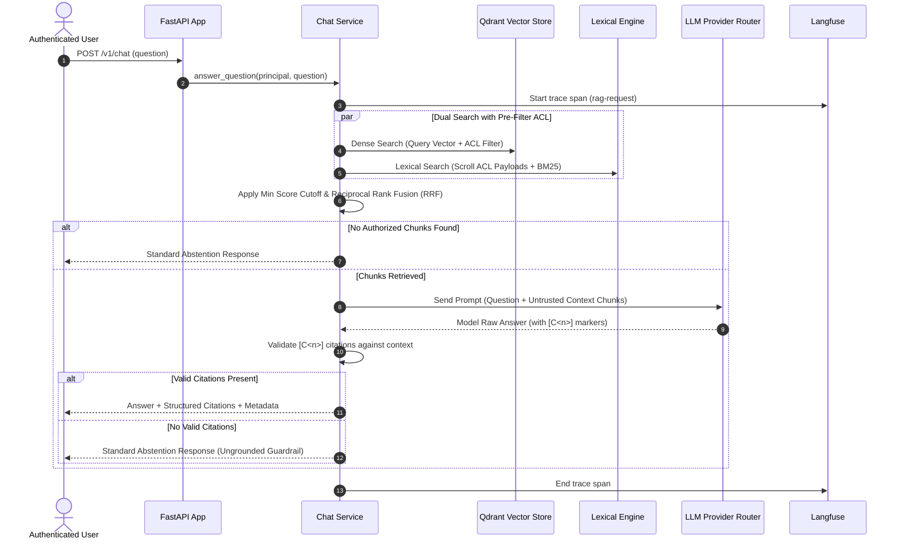

# Architecture Document: Company Knowledge RAG

## System Overview

Company Knowledge RAG is an enterprise-grade, source-grounded Retrieval-Augmented Generation (RAG) system built with **FastAPI**, **Qdrant**, and **Langfuse**. It enables internal employees to query confidential company documents safely by enforcing **Role-Based Access Control (RBAC/ACL)** at the vector retrieval layer, combining **Dense & Lexical (BM25) Hybrid Search** via Reciprocal Rank Fusion (RRF), and strictly validating LLM responses using **Citation-Gated Abstention**.

> [!NOTE]
> **Fresher AI Engineer Key Takeaway**: In enterprise RAG systems, accuracy and authorization are paramount. We cannot let users see data they aren't authorized to access, nor can we allow LLMs to "hallucinate" unbacked facts. This system guarantees pre-retrieval ACL filtering and post-generation citation verification.

## Architecture Diagram

## Core Components

### 1. API & Security Layer (`api/`)
- **Purpose**: Exposes authenticated REST endpoints for document management, chat, health checks, and readiness.
- **Key Modules**: [`app.py`](src/company_knowledge_rag/api/app.py), [`auth.py`](src/company_knowledge_rag/api/auth.py), [`settings.py`](src/company_knowledge_rag/settings.py)
- **Key Responsibilities**:
  - Validates `X-API-Key` headers and extracts user `Principal` and assigned `roles`.
  - Enforces role authorization on upload: callers cannot upload documents with roles they do not hold.
  - Implements `/health` (process status) and `/ready` (vector store and LLM provider health check).

### 2. Ingestion & Document Pipeline (`ingestion/`)
- **Purpose**: Parses, versions, chunks, enriches, and indexes raw documents into search-ready vectors.
- **Key Modules**: [`service.py`](src/company_knowledge_rag/ingestion/service.py), [`parser.py`](src/company_knowledge_rag/ingestion/parser.py), [`chunker.py`](src/company_knowledge_rag/ingestion/chunker.py), [`enrichment.py`](src/company_knowledge_rag/ingestion/enrichment.py)
- **Key Responsibilities**:
  - **Parsing**: Converts UTF-8 Markdown, Plain Text, and PDF files. Sets status to `ready`, `needs_ocr`, or `failed`.
  - **Deterministic Chunking**: Splits text into section-aware chunks (up to ~1,200 chars) with deterministic position IDs.
  - **LLM Contextual Enrichment**: Optionally generates structured chunk summaries, hypothetical questions, and metadata, prepending them to `retrieval_text`.

### 3. Indexing & Storage Layer (`storage/` & `retrieval/`)
- **Purpose**: Manages multi-tiered persistence for raw sources, metadata, embeddings, and lexical payloads.
- **Key Modules**: [`registry.py`](src/company_knowledge_rag/storage/registry.py), [`qdrant_store.py`](src/company_knowledge_rag/retrieval/qdrant_store.py)
- **Key Responsibilities**:
  - **Source Store**: Stores raw upload bytes in `data/uploads/` to enable reindexing.
  - **Document Registry**: Tracks document IDs, versions, content hashes, ACLs, and statuses in `data/registry.json`.
  - **Vector Collection**: Stores 3072-dimensional embeddings in Qdrant using cosine similarity, with payload indexes on `allowed_roles`, `status`, `document_id`, and `version`.

### 4. Retrieval & Generation Engine (`retrieval/` & `generation/`)
- **Purpose**: Retrieves authorized document chunks, builds prompts, calls LLM providers, and validates citations.
- **Key Modules**: [`hybrid.py`](src/company_knowledge_rag/retrieval/hybrid.py), [`service.py`](src/company_knowledge_rag/generation/service.py), [`router.py`](src/company_knowledge_rag/providers/router.py), [`answer_v1.py`](src/company_knowledge_rag/prompts/answer_v1.py)
- **Key Responsibilities**:
  - **Hybrid Search**: Combines Qdrant Dense Vector search with in-process BM25 Lexical search via Reciprocal Rank Fusion (RRF, `k=60`).
  - **Pre-Retrieval ACL Filtering**: Ensures unauthorized chunks are filtered out at the Qdrant filter level *before* scoring.
  - **Citation Gate & Abstention**: Validates that LLM output contains valid `[C<n>]` citation markers mapping to retrieved context; converts uncited outputs to standard abstention answers.

### 5. Observability & Quality Evaluation (`observability/` & `evaluation/`)
- **Purpose**: Provides operational tracing and automated quality evaluation.
- **Key Modules**: [`tracing.py`](src/company_knowledge_rag/observability/tracing.py), [`runner.py`](src/company_knowledge_rag/evaluation/runner.py)
- **Key Responsibilities**:
  - **Langfuse Tracing**: Captures nested request, retrieval, and generation spans. Supports `off`, `metadata-only` (default for privacy), and `full` trace modes.
  - **Golden-Set Evaluator**: Evaluates performance on golden-set datasets for retrieval accuracy, citation coverage, groundedness, abstention precision, and latency.

## Data Flow

### Ingestion Flow

### Retrieval & Question Answering Flow

## Security & Governance

- **Strict Access Control List (ACL)**: Documents are tagged with `allowed_roles`. Every vector search query enforces a pre-filtering clause (`allowed_roles INTERSECT principal_roles != EMPTY AND status == 'ready'`). Unauthorized data never reaches the ranking phase or prompt context.
- **Role Invariant Enforcement**: Users cannot assign roles to uploaded documents that they do not possess themselves.
- **Trace Privacy Modes**: Defaults to `metadata-only` tracing to prevent sensitive text from leaking into third-party observability backends like Langfuse.
- **Prompt Injection Defense**: Context chunks are wrapped in strict untrusted data blocks within system prompts, telling the LLM to ignore user instructions contained inside ingested documents.

## Key Design Decisions

| Decision | Choice Made | Rationale for Fresher AI Engineers | Alternatives & Why Rejected |
|---|---|---|---|
| **Vector DB** | Qdrant | Built-in payload indexing & native boolean pre-filtering for fast ACL checks. | ChromaDB (less flexible production ACL filtering), FAISS (lacks native metadata payload indexing). |
| **Hybrid Search** | Dense + BM25 via RRF | Dense vectors capture semantic intent; BM25 captures exact IDs/code/jargon. RRF balances them smoothly without score normalization issues. | Dense-only (misses exact keyword matches like product codes), Vector+Sparse (requires complex sparse models). |
| **Abstention Gate** | Hard Citation Regex Verification (`[C<n>]`) | Prevents hallucinations by rejecting answer outputs if the model fails to cite retrieved context. | Trusting LLM output directly (risks hallucinations in enterprise settings). |
| **Document Registry** | Lightweight JSON File (`data/registry.json`) | Simple, zero-dependency storage ideal for single-instance applications and hackathons/prototypes. | PostgreSQL (adds database setup overhead for smaller deployments; migrate when scaling out). |

## Architectural Index & Detailed Guides

| Guide | Deep-Dive Subject | Implementation Link |
|---|---|---|
| 01. System Context | Components, boundaries, entry points, deployment topology | [01-system-context.md](docs/architectures/01-system-context.md) |
| 02. Document Loading & Ingestion | File parsing, versioning, chunking, LLM enrichment pipeline | [02-document-loading-and-ingestion.md](docs/architectures/02-document-loading-and-ingestion.md) |
| 03. Indexing, Storage & ACL | Registry, source storage, Qdrant vectors, pre-filtering ACL | [03-indexing-storage-and-access-control.md](docs/architectures/03-indexing-storage-and-access-control.md) |
| 04. Retrieval, Generation & Citations | Hybrid search, RRF, prompt formatting, citation gating | [04-retrieval-generation-and-citations.md](docs/architectures/04-retrieval-generation-and-citations.md) |
| 05. Observability & Operations | Langfuse tracing, golden-set evaluation, health/readiness endpoints | [05-observability-evaluation-and-operations.md](docs/architectures/05-observability-evaluation-and-operations.md) |

For setup and quickstart instructions, see [README.md](README.md).
