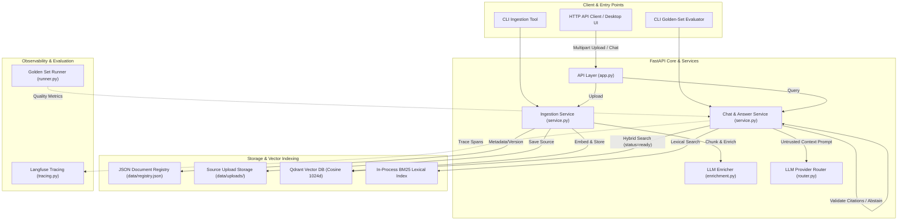

# Architecture Document: Company Knowledge RAG

## System Overview

Company Knowledge RAG is an enterprise-grade, source-grounded Retrieval-Augmented Generation (RAG) system built with **FastAPI**, **Qdrant**, and **Langfuse**. Operating as a **single-user / open workspace RAG assistant**, it enables users to ingest and query internal documents seamlessly, combining **Dense & Lexical (BM25) Hybrid Search** via Reciprocal Rank Fusion (RRF) and strictly validating LLM responses using **Citation-Gated Abstention**.

> [!NOTE]
> **Fresher AI Engineer Key Takeaway**: In open workspace local RAG systems, user experience and source-grounded accuracy are paramount. By removing multi-tenant authentication barriers, the system provides instant document access while maintaining strict post-generation citation verification to eliminate hallucinations.

---

## Key Architectural Decisions by RAG Phase

The table below outlines the core technical decisions, underlying engineering rationale, and primary implementation modules for each phase of the RAG pipeline.

### Phase 1: Ingestion & Indexing (Offline)
- **1.1 Document Loading & Cleaning**:
  - *Key Decision*: Standardize multi-format parsing (PDF, Markdown, Text) with Unicode NFC normalization and status tracking (`ready`, `needs_ocr`, `failed`).
  - *Rationale*: Eliminates text noise to prevent downstream retrieval degradation.
  - *Primary File*: [`src/ingestion/parser.py`](src/ingestion/parser.py)
- **1.2 Chunking Strategy**:
  - *Key Decision*: Section-aware recursive character chunking (~1,200 chars with 10–20% overlap).
  - *Rationale*: Preserves natural paragraph boundaries while preventing context truncation at chunk seams.
  - *Primary File*: [`src/ingestion/chunker.py`](src/ingestion/chunker.py)
- **1.3 Contextual Enrichment (Optional)**:
  - *Key Decision*: Prepend LLM-generated summaries and hypothetical questions to retrieval text.
  - *Rationale*: Enhances recall for high-level thematic queries that lack direct keyword matches.
  - *Primary File*: [`src/ingestion/enrichment.py`](src/ingestion/enrichment.py)
- **1.4 Vector & Storage Engine**:
  - *Key Decision*: Decoupled Qdrant Vector DB (Cosine 1024d, Gemini embeddings), JSON Registry (`data/registry.json`), and Raw Source Retention (`data/uploads/`).
  - *Rationale*: Enables instant reindexing without re-uploading bytes and restricts vector queries to ready files.
  - *Primary Files*: [`src/storage/registry.py`](src/storage/registry.py), [`src/retrieval/qdrant_store.py`](src/retrieval/qdrant_store.py)

### Phase 2: Query & Retrieval (Runtime)
- **2.1 Hybrid Retrieval Strategy**:
  - *Key Decision*: Parallel Qdrant Dense Search + In-process BM25 Lexical Search fused via **Reciprocal Rank Fusion (RRF k=60)**.
  - *Rationale*: Overcomes the "hard ceiling" of vector-only search by capturing exact keywords, names, and IDs via BM25 alongside semantic vectors.
  - *Primary File*: [`src/retrieval/hybrid.py`](src/retrieval/hybrid.py)
- **2.2 Score Thresholding**:
  - *Key Decision*: `min_dense_score` gating before prompt rendering.
  - *Rationale*: Filters out low-relevance noise to save tokens and improve answer quality.
  - *Primary File*: [`src/generation/service.py`](src/generation/service.py)

### Phase 3: Generation & LLM Routing (Runtime)
- **3.1 Prompt Context Isolation**:
  - *Key Decision*: Untrusted context blocks (`<context>` tags) in system prompt (`answer_v1.py`).
  - *Rationale*: Protects against prompt injection from ingested document text.
  - *Primary File*: [`src/prompts/answer_v1.py`](src/prompts/answer_v1.py)
- **3.2 Provider Failover Router**:
  - *Key Decision*: Multi-provider LLM Router (Gemini, OpenRouter, OpenAI) with automatic retry fallback.
  - *Rationale*: Prevents service downtime caused by third-party provider outages or rate limits.
  - *Primary File*: [`src/providers/router.py`](src/providers/router.py)

### Phase 4: Safety & Citation Guardrails (Runtime)
- **4.1 Citation Verification & Abstention Guard**:
  - *Key Decision*: Deterministic regex validation of `[C1]`, `[C2]` citation markers; forces automatic abstention (*"Không tìm thấy thông tin phù hợp..."*) if citations are missing or invalid.
  - *Rationale*: Guarantees zero ungrounded hallucinations.
  - *Primary File*: [`src/generation/service.py`](src/generation/service.py)

### Phase 5: Operations & Quality Evaluation
- **5.1 Observability & Telemetry**:
  - *Key Decision*: Langfuse span tracing with configurable privacy modes (`off`, `metadata-only`, `full`).
  - *Primary File*: [`src/observability/tracing.py`](src/observability/tracing.py)
- **5.2 Golden Set Evaluation**:
  - *Key Decision*: Automated CLI runner (`company-rag-evaluate`) against `evaluation/golden_set.json` to catch silent retrieval regressions.
  - *Primary File*: [`src/evaluation/runner.py`](src/evaluation/runner.py)

---

## Architecture Topology

## Core Components Matrix

| Subsystem / Component | Responsibility | Implementation File | Key Interfaces / Schema |
| --- | --- | --- | --- |
| **API Layer** | Exposes open REST endpoints for uploads, chat, document management, health, and OpenAPI docs. | [`src/api/app.py`](src/api/app.py) | `create_app()`, `/v1/documents`, `/v1/chat` |
| **Ingestion Pipeline** | Parses raw documents, manages content hashing, chunks text, and enriches metadata. | [`src/ingestion/service.py`](src/ingestion/service.py) | `IngestionService.ingest_bytes()` |
| **Document Registry** | Stores document metadata, versions, SHA-256 hashes, and processing statuses. | [`src/storage/registry.py`](src/storage/registry.py) | `DocumentRegistry`, `data/registry.json` |
| **Vector & Lexical Store** | Handles vector embedding, Qdrant indexing, status filtering, and BM25 scoring. | [`src/retrieval/qdrant_store.py`](src/retrieval/qdrant_store.py) | `QdrantChunkStore`, `MemoryChunkStore` |
| **Generation Engine** | Constructs prompts, handles provider failovers, calls LLMs, and verifies citations. | [`src/generation/service.py`](src/generation/service.py) | `ChatService.answer()` |
| **Observability** | Emits structured telemetry spans (request, retrieval, generation) to Langfuse. | [`src/observability/tracing.py`](src/observability/tracing.py) | `Tracer`, `TraceMode` |
| **Quality Evaluation** | Automated golden-set runner for testing retrieval, citations, abstention, and latency. | [`src/evaluation/runner.py`](src/evaluation/runner.py) | `company-rag-evaluate` |
