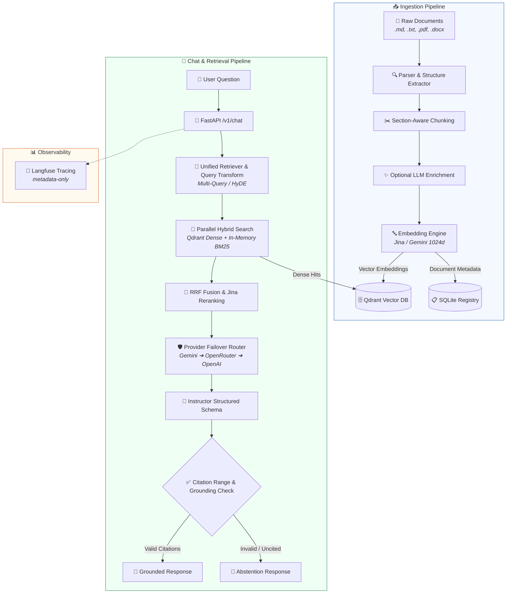

# Company Knowledge RAG

Production-oriented Retrieval-Augmented Generation (RAG) system for internal company documents built with **FastAPI**, **Qdrant**, **Gemini / OpenRouter / OpenAI**, **Instructor**, and **Langfuse**.

---

## ✨ Features

- **📄 Multi-Format Ingestion**: Supports `.md`, `.txt`, `.pdf`, and `.docx` with section-aware chunking and optional LLM context enrichment.
- **⚡ Hybrid Retrieval Engine**: Combines **Qdrant Dense Vector Search** with **In-Process BM25 Lexical Search** using Reciprocal Rank Fusion (RRF).
- **🛡️ Grounded Answers & Citation Gating**: Enforces post-generation citation verification to prevent hallucinations and auto-abstain on uncited claims.
- **🔄 Multi-Provider Failover & Key Rotation**: Resilient LLM router (`Gemini` ➔ `OpenRouter` ➔ `OpenAI`) with round-robin Gemini API key rotation pool.
- **🔒 Privacy-First Telemetry**: Integrated **Langfuse** tracing running in `metadata-only` mode to protect raw document text.
- **📊 Built-in Quality Benchmarking**: CLI suite for evaluating RAG pipelines against golden datasets (Hit Rate, Groundedness, Citation Coverage, Latency).

---

## 🏗️ Architecture & Data Flow Pipeline

### Data Flow Pipeline



### Core Modules

| Module | Location | Primary Responsibility |
| :--- | :--- | :--- |
| **API** | [`src/api/`](src/api/) | FastAPI web endpoints (`/v1/chat`, `/v1/documents`, `/health`, `/ready`) |
| **Ingestion** | [`src/ingestion/`](src/ingestion/) | Document parsing, NFC cleaning, section chunking, LLM enrichment |
| **Retrieval** | [`src/retrieval/`](src/retrieval/) | Qdrant vector search, BM25 indexing, RRF fusion engine |
| **Providers** | [`src/providers/`](src/providers/) | Gemini key rotation, multi-provider LLM failover router |
| **Generation** | [`src/generation/`](src/generation/) | Structured response generation & post-generation citation validation |
| **Observability** | [`src/observability/`](src/observability/) | Langfuse tracing and privacy-first metadata anonymization |
| **Evaluation** | [`src/evaluation/`](src/evaluation/) | Golden-set evaluation harness and benchmark metrics |

> 📖 For detailed architectural specifications and design rationale, see [`RAG-ARCHITECTURE.md`](RAG-ARCHITECTURE.md).

---

## 🚀 Quickstart & Usage Guide

### Prerequisites

- **Python**: `>= 3.11`
- **Package Manager**: [`uv`](https://docs.astral.sh/uv/)
- **Qdrant**: Access to a Qdrant instance (Local Docker or Qdrant Cloud)

### 1. Setup Environment

Clone the repository and prepare your configuration:

```bash
cp .env.example .env
```

Configure essential keys in `.env`:
- `GEMINI_API_KEY`: *(Required)* Key for embeddings and main LLM inference.
- `QDRANT_URL` & `QDRANT_API_KEY`: *(Required)* Qdrant instance URL (e.g. `http://localhost:6333`) and access key.
- `MAIN_PROVIDER`: Primary LLM provider (`gemini`, `openrouter`, `openai`).

### 2. Install Dependencies

```bash
uv sync --locked --group dev
```

### 3. Start API Server

```bash
uv run company-rag-serve --reload
```

Interactive API documentation will be available at **[`http://localhost:8000/docs`](http://localhost:8000/docs)**.

---

## 💻 CLI & API Reference

### CLI Commands

| Command | Description |
| :--- | :--- |
| `uv run company-rag-serve --host 0.0.0.0 --port 8000` | Run production API server |
| `uv run company-rag-ingest ./data/seed` | Ingest a directory of documents |
| `rag-eval validate` | Validate the authoritative staged evaluation dataset |

The staged evaluator, including the seven operator commands, replay contract,
and artifact layout, is documented in
[Quality Evaluation & Operations](docs/architectures/05-observability-evaluation-and-operations.md#staged-offline-rag-evaluation).

### Quick API Examples

#### Upload Document (`POST /v1/documents`)
```bash
curl -X POST http://localhost:8000/v1/documents \
  -F "file=@policy.md;type=text/markdown" \
  -F 'metadata={"department":"hr"}'
```

#### Query RAG Chat (`POST /v1/chat`)
```bash
curl -X POST http://localhost:8000/v1/chat \
  -H "Content-Type: application/json" \
  -d '{"question":"What is the company leave policy?"}'
```

#### Health Probes
```bash
curl http://localhost:8000/health   # Liveness check
curl http://localhost:8000/ready    # Readiness check (Qdrant & LLM providers)
```

---

## ⚙️ Configuration Reference

| Environment Variable | Default | Description |
| :--- | :--- | :--- |
| `MAIN_PROVIDER` | `gemini` | Primary LLM provider (`gemini`, `openrouter`, `openai`) |
| `GEMINI_API_KEY` | *Required* | Gemini API Key for embeddings & generation |
| `GEMINI_API_FALLBACK_KEY` | `None` | Secondary API key for Gemini key rotation pool |
| `QDRANT_URL` | `http://localhost:6333` | Qdrant vector database URL |
| `QDRANT_API_KEY` | `None` | Qdrant database API Key |
| `OPENROUTER_API_KEY` | `None` | API Key for OpenRouter fallback |
| `OPENAI_API_KEY` | `None` | API Key for OpenAI fallback |
| `EMBEDDING_MODEL` | `jina-embeddings-v5-omni-small` | Model used for vector embeddings |
| `EMBEDDING_DIMENSIONS` | `1024` | Vector dimension size |
| `TRACE_MODE` | `metadata-only` | Langfuse tracing mode (`metadata-only`, `full`, `disabled`) |
| `ENABLE_ENRICHMENT` | `false` | Enable LLM-based chunk summarization & synthetic queries |

---

## 🔭 Observability

This project integrates with **Langfuse** for LLM execution tracing and analytics.

```dotenv
LANGFUSE_PUBLIC_KEY=pk-lf-...
LANGFUSE_SECRET_KEY=sk-lf-...
LANGFUSE_BASE_URL=https://cloud.langfuse.com
TRACE_MODE=metadata-only
```

> 🔒 **Privacy Note**: `TRACE_MODE=metadata-only` is enabled by default to ensure raw document content and query text are stripped before telemetry data is sent.

---

## 🧪 Testing & Code Quality

Run tests and static analysis tools before submitting changes:

```bash
# Run test suite
uv run pytest

# Run Linter
uv run ruff check .

# Run Type Checker
uv run mypy
```

---

## ❓ FAQ & Troubleshooting

- **`/ready` returns `503 Service Unavailable`**: Verify `GEMINI_API_KEY`, Qdrant connection, and ensure `EMBEDDING_DIMENSIONS` matches the Qdrant collection settings.
- **Vector Dimension Mismatch**: If Qdrant reports size mismatch errors, delete the collection and re-ingest documents using the matching `EMBEDDING_DIMENSIONS`.
- **Chat returns Abstention**: Occurs when search scores fall below `MIN_DENSE_SCORE` or generated citations fail validation. Check document indexing and retrieval settings.
- **Document upload returns `needs_ocr`**: The uploaded PDF contains scanned images without selectable text. Perform OCR preprocessing before indexing.
