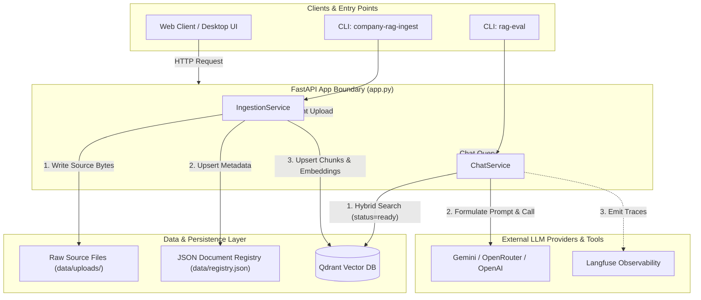

# System Context and Components

## Fresher AI Engineer Key Concepts

> [!NOTE]
> **What is System Context & Single-User Open Workspace Architecture?**  
> In single-user local RAG applications (such as Codex or Claude Cowork assistants), the **System Context** defines how different components communicate seamlessly to process document ingestion and answer queries without multi-tenant authorization friction. The system focuses on open document access and source-grounded citation accuracy.

## Purpose

Company Knowledge RAG is designed to answer enterprise internal questions strictly using ingested local documents in a single-user / open workspace model.

Its operational architecture relies on:
1. Open REST API endpoints for instant document upload and interactive querying.
2. Status-based vector indexing (`status == "ready"`) ensuring all processed files are globally searchable.
3. Post-generation citation verification to eliminate hallucinations.

## Component Matrix

| Subsystem / Component | Responsibility | Implementation File | Key Interfaces / Schema |
| --- | --- | --- | --- |
| **API Layer** | Exposes HTTP routes for uploads, chat, document management, health, and OpenAPI docs. | [`src/api/app.py`](../../src/api/app.py) | `create_app()`, `/v1/documents`, `/v1/chat` |
| **Ingestion Pipeline** | Parses raw documents, manages content hashing, chunks text, and enriches metadata. | [`src/ingestion/service.py`](../../src/ingestion/service.py) | `IngestionService.ingest_bytes()` |
| **Document Registry** | Stores document metadata, versions, SHA-256 hashes, and processing statuses. | [`src/storage/registry.py`](../../src/storage/registry.py) | `DocumentRegistry`, `data/registry.json` |
| **Vector & Lexical Store** | Handles vector embedding, Qdrant indexing, status filtering, and BM25 scoring. | [`src/retrieval/qdrant_store.py`](../../src/retrieval/qdrant_store.py) | `QdrantChunkStore`, `MemoryChunkStore` |
| **Generation Engine** | Constructs prompts, handles provider failovers, calls LLMs, and verifies citations. | [`src/generation/service.py`](../../src/generation/service.py) | `ChatService.answer()` |
| **Observability** | Emits structured telemetry spans (request, retrieval, generation) to Langfuse. | [`src/observability/tracing.py`](../../src/observability/tracing.py) | `Tracer`, `TraceMode` |
| **Quality Evaluation** | Staged golden-set validation, retrieval, generation replay, and end-to-end evaluation. | [`src/evaluation/runner.py`](../../src/evaluation/runner.py) | `rag-eval` |

## Runtime Topology

## API Entry Points & CLI Tools

### REST Endpoints
- **`POST /v1/documents`**: Accepts multipart file uploads. Ingests the document and returns its status.
- **`GET /v1/documents/{document_id}`**: Retrieves document metadata, SHA-256 hash, chunk count, and processing status by ID.
- **`POST /v1/documents/{document_id}/reindex`**: Re-reads retained source bytes from disk and re-runs ingestion.
- **`POST /v1/chat`**: Accepts a question payload, performs hybrid retrieval across ready chunks, calls the LLM provider, and enforces citation gating.
- **`GET /health`**: Process liveness check returning service and primary LLM model identity.
- **`GET /ready`**: Operational readiness check verifying connection health for both Qdrant and LLM providers.

### Command-Line Interface (CLI) Tools
- **`company-rag-serve`**: Launches the FastAPI application via Uvicorn server (`src/cli.py`).
- **`company-rag-ingest`**: Batch loads local Markdown/Text/PDF/DOCX files or directories through the core `IngestionService`.
- **`rag-eval`**: Runs the staged evaluator. Start with `rag-eval validate`; the [operations contract](05-observability-evaluation-and-operations.md#staged-offline-rag-evaluation) defines selection, replay, artifacts, and the optional external run.

## Deployment Architecture

The environment can be orchestrated via Docker Compose or local execution:
- **`api` Container**: Hosts the FastAPI service. Mounts volume `rag_data` to store uploaded bytes (`data/uploads/`) and document registry metadata (`data/registry.json`).
- **`qdrant` Container**: Hosts the vector database engine. Mounts volume `qdrant_data` for vector persistence. Bound to `127.0.0.1:6333` by default.

For compose setup details, see [`docker-compose.yml`](../../docker-compose.yml).
