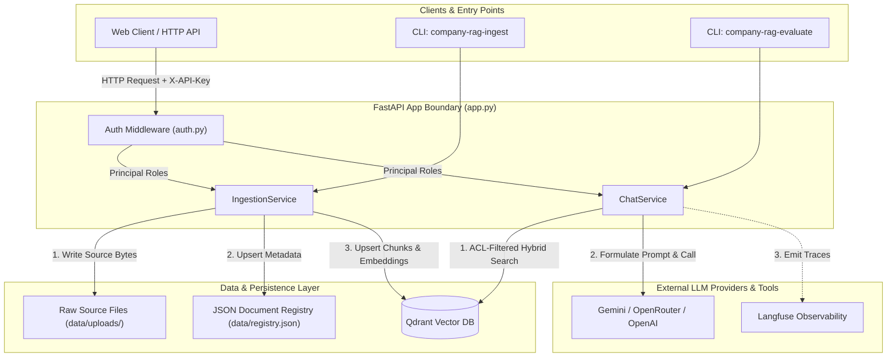

# System Context and Components

## Fresher AI Engineer Key Concepts

> [!NOTE]
> **What is System Context & Trust Boundary?**  
> In production RAG applications, the **System Context** defines how different parts of the application communicate, while the **Trust Boundary** defines where security checks occur. For Company Knowledge RAG, the API endpoint is the trust boundary: incoming requests must prove who they are via an API key, which maps to a set of authorized roles (`Principal`). These roles govern what documents can be searched and returned.

## Purpose

Company Knowledge RAG is designed to answer enterprise internal questions strictly using authorized internal documents. 

Its security architecture relies on an **API Trust Boundary**:
1. Every incoming HTTP request or CLI command is authenticated.
2. Authentication yields a `Principal` carrying a unique subject ID and a list of `roles` (e.g., `["engineering", "hr"]`).
3. The `Principal` roles travel with the request down to vector search pre-filtering, guaranteeing that unauthorized chunks are never returned or shown to the LLM.

## Component Matrix

| Subsystem / Component | Responsibility | Implementation File | Key Interfaces / Schema |
| --- | --- | --- | --- |
| **API Layer** | Exposes HTTP routes for uploads, chat, document management, health, and OpenAPI docs. | [`api/app.py`](../../src/company_knowledge_rag/api/app.py) | `create_app()`, `/v1/documents`, `/v1/chat` |
| **Authentication & AuthZ** | Maps `X-API-Key` headers to `Principal` objects and validates role permissions. | [`api/auth.py`](../../src/company_knowledge_rag/api/auth.py) | `get_principal()`, `Principal(roles)` |
| **Ingestion Pipeline** | Parses raw documents, manages content hashing, chunks text, and enriches metadata. | [`ingestion/service.py`](../../src/company_knowledge_rag/ingestion/service.py) | `IngestionService.ingest_document()` |
| **Document Registry** | Stores document metadata, versions, SHA-256 hashes, and processing statuses. | [`storage/registry.py`](../../src/company_knowledge_rag/storage/registry.py) | `JSONDocumentRegistry`, `data/registry.json` |
| **Vector & Lexical Store** | Handles vector embedding, Qdrant payload indexing, ACL filtering, and BM25 scoring. | [`retrieval/qdrant_store.py`](../../src/company_knowledge_rag/retrieval/qdrant_store.py) | `QdrantChunkStore`, `HybridSearcher` |
| **Generation Engine** | Constructs prompts, handles provider failovers, calls LLMs, and verifies citations. | [`generation/service.py`](../../src/company_knowledge_rag/generation/service.py) | `ChatService.answer_question()` |
| **Observability** | Emits structured telemetry spans (request, retrieval, generation) to Langfuse. | [`observability/tracing.py`](../../src/company_knowledge_rag/observability/tracing.py) | `LangfuseTracer`, `TraceMode` |
| **Quality Evaluation** | Automated golden-set runner for testing retrieval, citations, abstention, and latency. | [`evaluation/runner.py`](../../src/company_knowledge_rag/evaluation/runner.py) | `company-rag-evaluate` |

## Runtime Topology

## API Entry Points & CLI Tools

### REST Endpoints
- **`POST /v1/documents`**: Accepts multipart file uploads with an `allowed_roles` string array. Validates caller authorization and ingests the document.
- **`POST /v1/documents/{document_id}/reindex`**: Re-reads the retained source bytes from disk and re-runs ingestion (useful when updating chunking or embedding configurations).
- **`POST /v1/chat`**: Accepts an authenticated question payload, performs ACL-filtered hybrid retrieval, calls the LLM provider, and enforces citation gating.
- **`GET /health`**: Process liveness check returning service and primary LLM model identity.
- **`GET /ready`**: Operational readiness check verifying connection health for both Qdrant and LLM providers.

### Command-Line Interface (CLI) Tools
- **`company-rag-ingest`**: Batch loads local Markdown/Text/PDF files or directories through the core `IngestionService`.
- **`company-rag-evaluate`**: Runs the regression suite against [`evaluation/golden_set.json`](../../evaluation/golden_set.json) and outputs a detailed benchmark report.

## Deployment Architecture

The production environment is orchestrated via Docker Compose:
- **`api` Container**: Hosts the FastAPI service. Mounts volume `rag_data` to store uploaded bytes (`data/uploads/`) and document registry metadata (`data/registry.json`).
- **`qdrant` Container**: Hosts the vector database engine. Mounts volume `qdrant_data` for vector persistence. Bound to `127.0.0.1:6333` by default to prevent external exposure.

For compose setup details, see [`docker-compose.yml`](../../docker-compose.yml).
