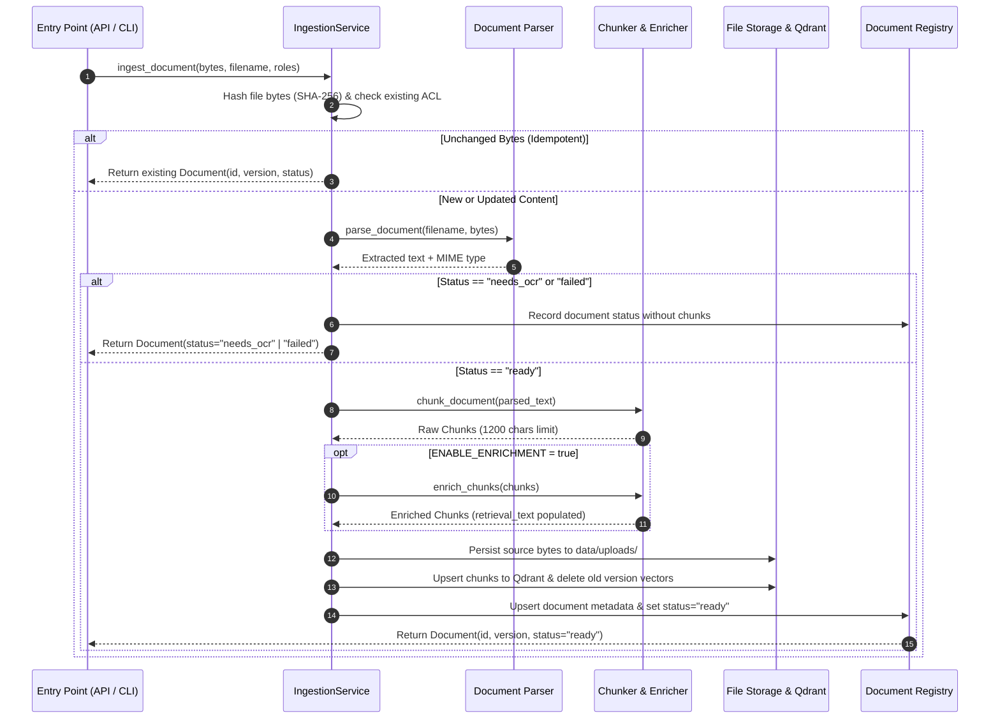

# Document Loading and Ingestion

## Fresher AI Engineer Key Concepts

> [!NOTE]
> **Core Concepts in Document Ingestion:**
> 1. **Document Ingestion**: The process of transforming raw unstructured files (PDFs, Markdown, text) into structured, search-ready embeddings.
> 2. **Document Status Machine**: A document transitions between states (`ready` if text extracted successfully, `needs_ocr` if image-only PDF, or `failed` if corrupt). Only `ready` documents produce indexable chunks.
> 3. **Content Hashing & Idempotency**: By hashing raw file bytes with SHA-256, re-uploading the exact same document avoids unnecessary re-indexing. Modifying content automatically increments the document version (`v1` -> `v2`).
> 4. **LLM Contextual Enrichment**: Large documents often lose context when chunked. Enrichment uses an LLM to generate summaries and hypothetical questions per chunk, prepending them to the vector search field (`retrieval_text`) while leaving the raw text (`text`) intact for exact user citations.

## Inputs and Authorization

Documents can enter the system via the HTTP REST endpoint (`POST /v1/documents`) or the CLI (`company-rag-ingest`).

### Input Constraints & Validation
- **Supported Formats**: UTF-8 `.md`, `.txt`, and text-extractable `.pdf`.
- **Size Limits**: Enforced by `MAX_UPLOAD_BYTES` (default: 20 MiB).
- **Access Control Guard**: Uploads require a non-empty list of `allowed_roles`.
  - **Role Invariant**: Proposed roles must be a subset of the authenticated caller's roles. Callers cannot grant permissions they do not hold.
  - **Re-ingestion Guard**: If the document name already exists, the caller must own the existing document and keep its ACL unchanged.

**Source Modules**: [`api/app.py`](../../src/company_knowledge_rag/api/app.py) and [`ingestion/service.py`](../../src/company_knowledge_rag/ingestion/service.py).

## Loading & Publication Sequence



### Parsing Behavior
- **Text & Markdown**: Read directly as UTF-8.
- **PDF Files**: Parsed using `pypdf`. If valid text is extracted, status becomes `ready`. If no text is found (e.g., scanned images), status becomes `needs_ocr`. Corrupted files become `failed`.
- **Source Preservation**: Original file bytes are stored under `data/uploads/{document_id}/v{version}` to allow future re-indexing without requiring re-upload.

## Chunking Strategy

Documents are split into smaller pieces before vector embedding using `chunk_document`:

- **Split Strategy**: Respects Markdown section headers (`#`, `##`, `###`) first, then splits long paragraphs into chunks up to **1,200 characters**.
- **Metadata Provenance**: Every chunk carries metadata required for search filtering and citation display:
  - `chunk_id`: Deterministic ID derived from `document_id` + `position`.
  - `document_id` & `version`: Version tracking.
  - `allowed_roles`: Copied directly from document ACL.
  - `section_header`: Nearby section title for context.
  - `sha256_hash`: Chunk content hash.

**Source Modules**: [`ingestion/chunker.py`](../../src/company_knowledge_rag/ingestion/chunker.py) and [`domain/schemas.py`](../../src/company_knowledge_rag/domain/schemas.py).

## LLM Contextual Enrichment Pipeline

When `ENABLE_ENRICHMENT=true` in configuration:

```text
               +-------------------------------------------+
               |               Raw Chunk                   |
               | "The server requires port 8080 open..."   |
               +-------------------------------------------+
                                     |
                                     v  (LLM Enrichment Call)
               +-------------------------------------------+
               | Generated Summary & Hypo Questions        |
               | "Summary: Server port configuration..."  |
               +-------------------------------------------+
                                     |
                                     v
   +-----------------------------------+-----------------------------------+
   |          retrieval_text           |               text                |
   | (Used for Qdrant Vector Embedding)|  (Used for Exact Citation Output) |
   | "[Summary] + [Questions] + Raw"   |  "The server requires port..."    |
   +-----------------------------------+-----------------------------------+
```

1. **Dual Text Representation**:
   - `retrieval_text`: Enriched context (Summary + Questions + Chunk Text) embedded into vector space for maximum retrieval recall.
   - `text`: Original untouched chunk text returned to the end user in citations to guarantee fidelity.
2. **Schema Validation**: Enrichment outputs are parsed into strict Pydantic schemas. If the provider returns malformed output, ingestion fails safely rather than storing dirty data.

**Source Module**: [`ingestion/enrichment.py`](../../src/company_knowledge_rag/ingestion/enrichment.py).
