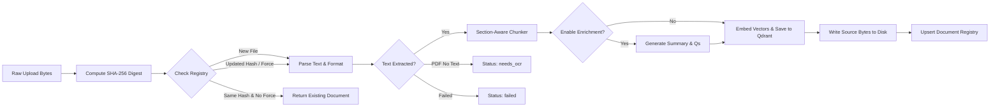

# Document Loading and Ingestion Pipeline

## Fresher AI Engineer Key Concepts

> [!NOTE]
> **Why is Ingestion the Foundation of RAG?**  
> An LLM is only as good as the context provided to it. The ingestion pipeline transforms raw unstructured documents (PDF, Markdown, Text) into clean, versioned, section-aware chunks stored in a vector database.

> [!TIP]
> **Deep dive with concrete input/output at every stage:**
> [`docs/references/CHUNKING-AND-RETRIEVAL-FLOW.md`](../references/CHUNKING-AND-RETRIEVAL-FLOW.md) (Vietnamese).
> This file is the summary; that one traces a real section through the whole pipeline.

## Overview

The ingestion pipeline handles raw file upload, content hashing, document parsing, deterministic chunking, optional LLM contextual enrichment, vector embedding, and persistence to both Qdrant and the local document registry.

## Pipeline Architecture

## Key Ingestion Steps

### 1. Versioning & SHA-256 De-duplication (`src/ingestion/service.py`)
- Every uploaded document undergoes SHA-256 hashing.
- If a document with the same source filename and hash exists, ingestion returns the existing document without reprocessing unless `force=True`.
- If the content hash changes, the document version increments (e.g. `v1` -> `v2`), and prior chunk versions are safely pruned from Qdrant.

### Evaluation ingestion and coordinate recovery

The staged evaluator keeps the raw DOCX and the canonical Markdown source as
separate identities. `data/raw/01_2021_ND-CP_283247.docx` is the opt-in
ingestion input; `data/extracted/01_2021_ND-CP_283247.md` is the stable source
used to validate golden excerpts and their legal `doc_id`, chapter, and article
coordinates. Running `rag-eval ingest --source data/raw/01_2021_ND-CP_283247.docx`
is idempotent for unchanged bytes; `--force-reingest` is permitted only when a
source is supplied.

Legacy Qdrant points that lack compatible canonical coordinates cannot be used
for staged retrieval. After wiping the local or dev collection, re-index from
the retained raw DOCX with
`rag-eval ingest --source data/raw/01_2021_ND-CP_283247.docx --force-reingest`.
The force flag is required when the registry still records the same source
bytes; otherwise idempotent ingestion skips the empty replacement index. Then
use the staged evaluator's preflight instead of treating old payloads as
equivalent. See the [evaluation operations contract](05-observability-evaluation-and-operations.md#staged-offline-rag-evaluation)
for the exact recovery and verification sequence.

### 2. Document Parsing (`src/ingestion/parser.py`)
- Supports `.md`, `.txt`, `.pdf`, and `.docx` formats.
- Extracted text is normalized to UTF-8. PDF files without extractable text are tagged with `status = DocumentStatus.NEEDS_OCR`.
- DOCX parsing walks the document body in order: Word heading styles become markdown headings so the chunker sees sections, and table rows are flattened to pipe-separated lines instead of being dropped.

### 3. Section-Aware Chunking (`src/ingestion/chunker.py` and `src/ingestion/structure.py`)
- `extract_legal_sections()` first cuts the text on legal headings (`Chương <roman>`, `Điều <n>`), falling back to markdown headings and then to a whole-document section. The current chapter is carried forward so every article records its `(doc_id, chapter, article)` coordinates.
- Each section is then split to a hard ceiling of 1,200 characters. `_split()` guarantees its pieces are **contiguous slices** whose `"".join(...)` reproduces `section.strip()` exactly -- retrieval scoring and sibling expansion both depend on that property.
- Every chunk records `parent_id` (version-scoped section identity), `parent_child_count`, and `child_index`, so retrieval can tell a complete sibling family from a partial one. See [`retrieval/hierarchical.py`](../../src/retrieval/hierarchical.py).

### 4. Optional Contextual LLM Enrichment (`src/ingestion/enrichment.py`)
- When `ENABLE_ENRICHMENT=true` in `settings.py`, an LLM pass returns a validated `ChunkEnrichment` object (instructor-backed, so no hand-rolled JSON parsing) containing:
  1. A concise chunk summary.
  2. Hypothetical user questions answered by the chunk (capped at 5).
  3. A contextual prefix and key/value metadata labels.
- These synthetic additions are prepended to `retrieval_text`, dramatically improving dense vector retrieval hit rates for abstract questions.

### 5. Vector Store Upsert (`src/retrieval/qdrant_store.py`)
- Chunks are embedded with **Jina (`jina-embeddings-v5-omni-small`, 1024-dimensional, cosine distance)**, configured by `EMBEDDING_MODEL` / `EMBEDDING_DIMENSIONS`. The text embedded is `chunk.retrieval_text or chunk.text`.
- The payload is the **whole** `Chunk.model_dump()` plus flattened coordinate fields, so `parent_id`, `parent_child_count`, and `child_index` are readable at query time with no extra schema.
- `replace_document()` embeds **before** deleting the previous version, so an embedding failure never leaves the document unindexed.
