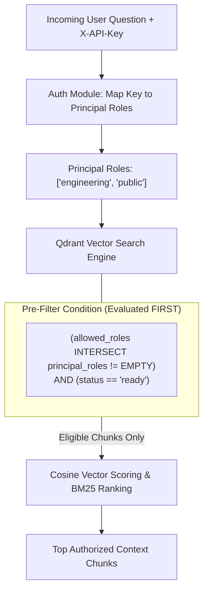

# Indexing, Storage, and Access Control

## Fresher AI Engineer Key Concepts

> [!NOTE]
> **Core Concepts in Storage & Access Control:**
> 1. **Multi-Tiered Storage**: Enterprise RAG systems store different data types in specialized tiers: raw binary files on disk for preservation, structured metadata in a registry for fast status lookup, and high-dimensional vectors in a Vector Database for similarity search.
> 2. **Pre-Filtering vs Post-Filtering ACL**: 
>    - *Post-filtering*: Running vector search to get top 10 matches, then dropping matches the user isn't allowed to see. **Dangerous!** If top matches are all restricted, the user gets 0 results or leaked metadata count.
>    - *Pre-filtering*: Injecting boolean security conditions directly into the Vector DB query *before* calculating similarity scores. **Secure & Accurate!** Only authorized vectors are scored.

## Stored Data Representations

| Data Category | Storage Location | Format / Structure | Purpose |
| --- | --- | --- | --- |
| **Source Bytes** | `data/uploads/{document_id}/v{version}` | Raw binary (`.pdf`, `.md`, `.txt`) | Enables future re-indexing without requiring client re-uploads. |
| **Document Registry** | `data/registry.json` | JSON key-value store | Tracks document metadata, version history, SHA-256 hashes, status, and ACL. |
| **Chunk Vectors & Payloads** | Qdrant Collection (`company_knowledge`) | 3072d Cosine Vector + JSON Payload | Powers ACL-filtered dense similarity search and lexical retrieval. |

> [!WARNING]
> **Registry Process Coordination**: The default JSON document registry is synchronized in-memory within a single API process. Before scaling the API out to multiple replicas, move the registry store to a shared transactional database (e.g., PostgreSQL).

## Vector Indexing & Embedding Setup

```text
  +-----------------------+      Gemini Embeddings      +-----------------------+
  |  chunk.retrieval_text | --------------------------> | 3072-Dimensional Vector|
  +-----------------------+      (3072 Dimensions)      +-----------------------+
                                                                    |
                                                                    v
                                                        +-----------------------+
                                                        |  Qdrant Vector Store  |
                                                        |  (Cosine Distance)    |
                                                        +-----------------------+
```

1. **Embedding Generation**: Uses `GeminiEmbeddingProvider` with `EMBEDDING_MODEL` producing **3,072-dimensional vectors**. If enrichment is active, `chunk.retrieval_text` is embedded; otherwise, `chunk.text` is used.
2. **Collection Configuration**: On initial startup, Qdrant creates the `company_knowledge` collection configured with **Cosine distance**.
3. **Payload Indexing**: To optimize search speeds, keyword indexes are explicitly created on key payload fields:
   - `allowed_roles` (used for ACL pre-filtering)
   - `status` (ensures only `ready` documents are searchable)
   - `document_id` & `version` (used for version cleanup and re-indexing)

**Source Modules**: [`api/app.py`](../../src/company_knowledge_rag/api/app.py), [`retrieval/qdrant_store.py`](../../src/company_knowledge_rag/retrieval/qdrant_store.py), and [`settings.py`](../../src/company_knowledge_rag/settings.py).

## Access Control List (ACL) Model

Security is built on **Principal-Based Pre-Filtering**:



### Logical Pre-Filter Rule
Qdrant enforces the following filter condition before vector ranking or lexical scrolling begins:

$$\text{allowed\_roles} \cap \text{principal\_roles} \neq \emptyset \quad \land \quad \text{status} == \text{"ready"}$$

### Security Guarantees
- An API caller without required roles will receive zero search candidates.
- Unauthorized document chunks are physically excluded from search candidate sets, preventing unauthorized data from entering the LLM prompt or trace logs.

## Versioning & Atomic Vector Replacement

When an existing source file is uploaded with updated content:

1. The service increments the document version (e.g., `v1` -> `v2`).
2. New chunks for `v2` are parsed, embedded, and upserted into Qdrant.
3. Once `v2` vector insertion completes successfully, vectors associated with previous versions (`v1`) for that `document_id` are deleted from Qdrant.

This guarantees zero downtime during re-indexing and ensures search queries always target the single active ready version of a document.

**Source Interfaces**: [`retrieval/base.py`](../../src/company_knowledge_rag/retrieval/base.py) and [`domain/schemas.py`](../../src/company_knowledge_rag/domain/schemas.py).
