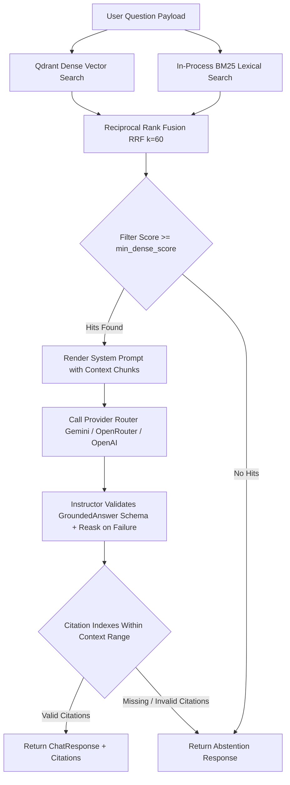

# Retrieval, Generation & Citations Pipeline

## Fresher AI Engineer Key Concepts

> [!NOTE]
> **What is Hybrid Search & Citation Gating?**  
> - **Hybrid Search** combines two complementary search strategies: **Dense Search** (understanding overall semantic context and meaning) and **Lexical Search** (matching exact names, technical terms, and IDs using BM25).
> - **Reciprocal Rank Fusion (RRF)** combines ranked results from both strategies into a unified, high-precision hit list.
> - **Citation Gating** reads the citation indexes the LLM returns in a validated `GroundedAnswer` object (via [instructor](https://github.com/567-labs/instructor)) and maps them back to retrieved text. If the model provides an answer without valid citations, the system forces an abstention response to prevent ungrounded hallucinations.

## Pipeline Architecture

## Detailed Workflow Steps

### 1. Hybrid Search (`src/retrieval/qdrant_store.py` & `src/retrieval/hybrid.py`)
- **Dense Vector Search**: Embeds the user query via Gemini (`gemini-embedding-001`, task `RETRIEVAL_QUERY`) and queries Qdrant with a filter on `status == "ready"`.
- **Lexical Search (BM25)**: Tokenizes ready chunk payloads using regex word boundaries and ranks them using `BM25Okapi`.
- **Reciprocal Rank Fusion**: Combines dense and lexical ranks using RRF scoring:
  $$\text{Score}(d) = \sum_{m \in \{\text{dense}, \text{lexical}\}} \frac{1}{60 + \text{rank}_m(d)}$$

### 2. Prompt Construction & System Safeguards (`src/prompts/answer_v2.py`)
- Retained context chunks are rendered inside strict untrusted data blocks (`<context>` tags) in system prompts.
- The prompt explicitly instructs the LLM to format every factual claim with citation tags (`[C1]`, `[C2]`) referencing the index of the corresponding context chunk, and to repeat those indexes in the structured `citations` field.

### 3. Provider Failover Router (`src/providers/router.py`)
- Dispatches prompt requests to the configured primary provider (e.g. Gemini, OpenRouter, or OpenAI).
- On transient network or rate-limit failures, automatically fails over to secondary configured providers.
- `generate_structured()` shares that failover path; a schema the model cannot satisfy raises a non-transient `ProviderError` instead of burning the fallback.

### 4. Structured Output Contract (`src/providers/structured.py`)
- Every provider exposes `generate_structured(request, response_model)` and returns a validated Pydantic object, never raw text.
- instructor selects the strongest mechanism per provider: native `responseSchema` for Gemini, tool calling for OpenAI, and prompt-carried JSON schema for OpenRouter's mixed backends.
- Malformed or invalid payloads are reasked with the validation error attached, up to `STRUCTURED_MAX_RETRIES` attempts.

### 5. Citation Verification & Abstention Guard (`src/generation/service.py`)
- Reads the `citations` list from the validated `GroundedAnswer`.
- Validates that `1 <= n <= len(chunks)` and maps each index to a `Citation` object containing source file name, document ID, version, and excerpt.
- If no citations are parsed or all citations map to invalid indices, the service overrides the answer with the standard abstention string:
  > *"Không tìm thấy thông tin phù hợp trong tài liệu được phép truy cập."*

## Staged evaluation replay

`rag-eval retrieval` saves the captured retrieval evidence before any generation
phase. `rag-eval generation --from-run <retrieval-run-id>` reloads that evidence
and inherits the retrieval run's golden directory, file scope, and canonical
source; it rejects incompatible dataset or artifact fingerprints rather than
silently selecting a new population. The detailed selection precedence,
write-once artifact paths, and report-only Ragas option are in the
[evaluation operations contract](05-observability-evaluation-and-operations.md#staged-offline-rag-evaluation).
