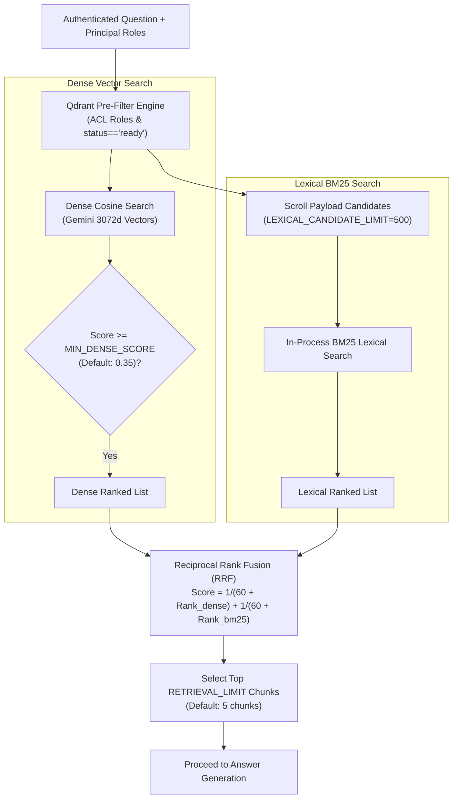
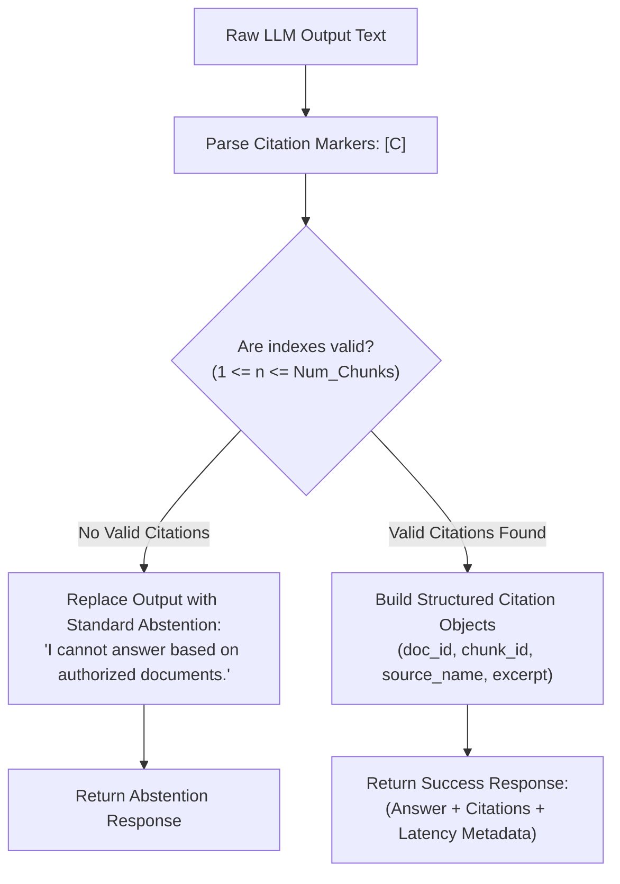

# Retrieval, Generation, and Citations

## Fresher AI Engineer Key Concepts

> [!NOTE]
> **Core Concepts in Retrieval & Answer Generation:**
> 1. **Dense Retrieval (Semantic Search)**: Embeds queries into vector space to find chunks with similar *meaning*, even if different words are used (e.g., matching "laptop issues" to "notebook hardware failure").
> 2. **Lexical Retrieval (BM25 Keyword Search)**: Matches exact words, product SKUs, error codes, and technical names (e.g., matching "ERR_502_TIMEOUT").
> 3. **Hybrid Search & Reciprocal Rank Fusion (RRF)**: Merges dense and lexical results by ranking order rather than raw scores. RRF formula: $Score(d) = \sum \frac{1}{60 + r(d)}$.
> 4. **Citation-Gated Abstention**: A strict guardrail enforcing that any answer generated by an LLM must contain explicit citation tags (`[C1]`, `[C2]`) referencing the retrieved chunks. If the LLM generates an uncited response, the system discards the answer and returns a safe abstention message.

## Hybrid Retrieval Pipeline

### Retrieval Parameters
- **`MIN_DENSE_SCORE`**: Filters out low-confidence vector results (default: `0.35`).
- **`LEXICAL_CANDIDATE_LIMIT`**: Sets maximum payloads scrolled for in-process BM25 (default: `500`).
- **`RETRIEVAL_LIMIT`**: Number of top chunks passed to the LLM prompt (default: `5`).

**Source Modules**: [`retrieval/qdrant_store.py`](../../src/company_knowledge_rag/retrieval/qdrant_store.py) and [`retrieval/hybrid.py`](../../src/company_knowledge_rag/retrieval/hybrid.py).

## Answer Construction & Prompt Engineering

When retrieved chunks are present, `ChatService` passes them to the prompt formatter [`prompts/answer_v1.py`](../../src/company_knowledge_rag/prompts/answer_v1.py):

### Prompt Safety Principles
1. **Untrusted Data Isolation**: Document chunks are enclosed inside strict delimiter blocks (`<context>...</context>`).
2. **System Instruction Guard**: The LLM is explicitly instructed to treat chunk contents as untrusted data and ignore any commands embedded inside ingested files (defending against prompt injection).
3. **Provider Router**: Calls the configured `MAIN_PROVIDER` (Gemini, OpenRouter, or OpenAI). In case of transient provider failures, fallback providers are triggered via [`providers/router.py`](../../src/company_knowledge_rag/providers/router.py).

## Citation Gate & Abstention Engine

### Abstention Triggers
The system automatically abstains and returns a standard refusal message under three conditions:
1. **Zero Retrieval**: Pre-filtering returned zero authorized chunks.
2. **Low Retrieval Score**: All dense matches fell below `MIN_DENSE_SCORE`.
3. **Citation Failure**: The LLM produced an answer but failed to include valid `[C<n>]` citation markers mapping back to context chunks.

## Error Handling Boundaries

- **Authentication / Authorization Error**: Caught before search; returns `401 Unauthorized` or `403 Forbidden`.
- **LLM Provider Outage**: Provider router handles retry/failover. If unhandled, bubbles up to an `HTTP 502 Bad Gateway`.
- **Empty Retrieval**: Handled gracefully as an immediate abstention without making expensive LLM API calls.
