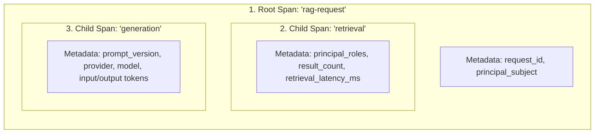
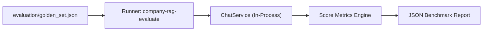

# Observation, Evaluation, and Operations

## Fresher AI Engineer Key Concepts

> [!NOTE]
> **Core Concepts in Observability & Quality Operations:**
> 1. **RAG Observability & Tracing**: In traditional web services, you log HTTP status codes. In RAG systems, you must trace the full lifecycle: request arrival -> ACL filter -> vector search timing -> prompt construction -> LLM response time & token usage.
> 2. **Trace Privacy Modes**: Enterprise documents contain PII and proprietary secrets. Observability tools (like Langfuse) should not store raw company text by default. *Metadata-only tracing* logs system health and latency without exporting document contents.
> 3. **Golden-Set Evaluation**: A benchmark dataset containing known questions, expected citations, and target answers. Running golden-set evaluations ensures code changes don't cause quality regressions.

## Runtime Observability (Langfuse Tracing)

During a chat request, `ChatService` emits three nested logical observation spans to [Langfuse](https://langfuse.com/):

- **Graceful Degrade**: If Langfuse credentials are missing or `TRACE_MODE=off`, the tracer falls back to a no-op implementation with zero performance impact.

**Source Module**: [`observability/tracing.py`](../../src/company_knowledge_rag/observability/tracing.py).

## Trace Privacy Modes

To protect sensitive corporate information, telemetry output is governed by `TRACE_MODE` in [`settings.py`](../../src/company_knowledge_rag/settings.py):

| Trace Mode | Raw Question Text | Context Chunks Text | Answer Text | Telemetry Logged |
| --- | --- | --- | --- | --- |
| `off` | Redacted | Redacted | Redacted | None |
| **`metadata-only` (Default)** | Redacted | Redacted | Redacted | Request ID, roles, chunk counts, latency, LLM model, token counts. |
| `full` | Included | Included | Included | Full payloads (Requires `ALLOW_SENSITIVE_TRACING=true`). |

> [!IMPORTANT]
> `metadata-only` is the safe production default. It provides complete operational metrics (latency, token costs, search candidate counts) without leaking confidential document text into third-party tracing platforms.

## Quality Evaluation Framework

The system includes a built-in evaluation framework executed via `company-rag-evaluate`:

### Measured Evaluation Metrics
- **Retrieval Hit**: Verifies if the correct source document was present in top retrieved chunks (or 0 hits for expected abstentions).
- **Groundedness Proxy**: Verifies if an answered question includes valid source citations.
- **Citation Coverage**: Calculates the percentage of answer sentences that contain valid `[C<n>]` citation markers.
- **Abstention Accuracy**: Measures precision in correctly abstaining when asked out-of-domain or unauthorized questions.
- **Latency (ms)**: Measures average and P95 retrieval & generation latency.

**Source Modules**: [`evaluation/runner.py`](../../src/company_knowledge_rag/evaluation/runner.py) and [`evaluation/golden_set.json`](../../evaluation/golden_set.json).

## Operational Health & Diagnostics

| Diagnostic Command / Endpoint | Type | Operational Purpose |
| --- | --- | --- |
| `GET /health` | Liveness Probe | Verifies the FastAPI server is running. Returns service version and configured LLM provider identity. |
| `GET /ready` | Readiness Probe | Checks connectivity to both the Qdrant vector database and the configured LLM provider API. Returns `200 OK` or `503 Service Unavailable`. |
| `company-rag-evaluate` | Functional CLI | Runs the golden-set test suite to measure accuracy, abstention, and retrieval quality. |
| `pytest` | Test Suite | Executes unit and integration test suites. |
| `ruff check .` & `mypy` | Code Quality | Enforces Python style, syntax standards, and type safety across all modules. |
