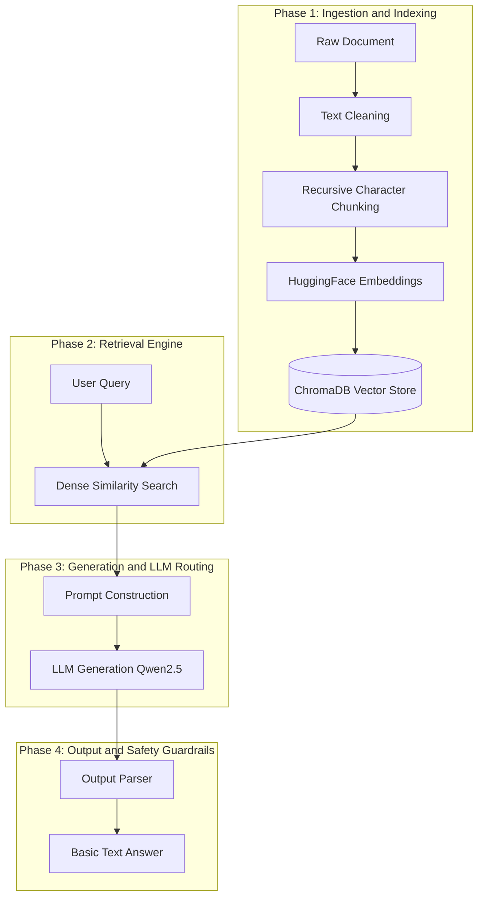
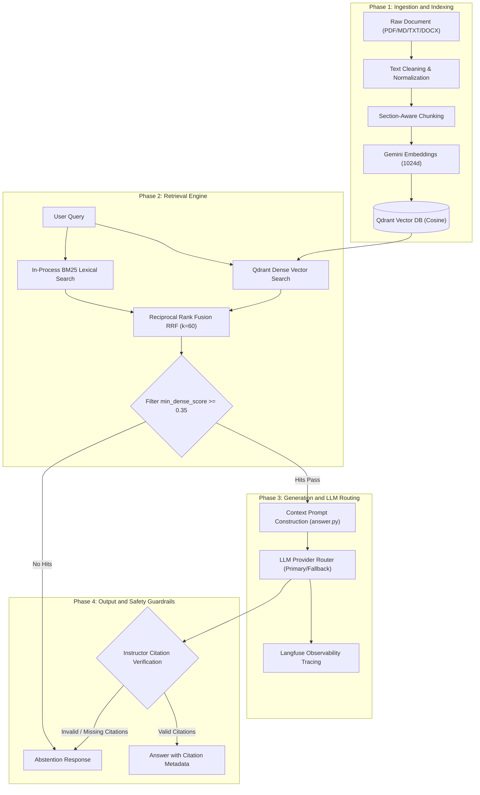

# RAG Pipeline Comparison: Simple RAG vs. Company Knowledge RAG

This document compares the baseline **Simple RAG Pipeline** (documented in [`Simple-RAG.pdf`](file:///E:/VIN-INTERNSHIP/Cowork-RAG/docs/references/Simple-RAG.pdf)) with the current **Company Knowledge RAG** core pipeline.

---

## 1. Executive Summary & Pipeline Alignment

### Alignment Score: ~100% Core Conceptual Pipeline | Advanced Pipeline Features: +300%

| Pipeline Phase | Baseline Simple RAG | Current Production RAG Pipeline | Evolution & Enhancements |
| :--- | :--- | :--- | :--- |
| **1. Ingestion & Indexing** | PDF loading, text cleaning, Recursive Text Splitter, HuggingFace embeddings, ChromaDB vector store | Multi-format parsing (PDF, MD, TXT, DOCX), text cleaning, Section-Aware Chunking, Gemini embeddings (`gemini-embedding-001`), Qdrant Vector DB with status filtering | **Aligned & Enhanced**: Multi-format & section-aware structure parsing, upgraded vector database (1024d Cosine) with state metadata (`status == "ready"`). |
| **2. Retrieval Engine** | Single-stream Dense Similarity Search (Cosine / top-k=4) | **Hybrid Retrieval**: Parallel Qdrant Dense Search (top-20) + In-process BM25 Lexical Search (limit 500) fused via **Reciprocal Rank Fusion (RRF k=60)** & `min_dense_score` (0.35) gating | **Major Upgrade**: Solves exact keyword matching limitations (names, technical terms, IDs) present in vector-only search, gated by score thresholding. |
| **3. Generation & LLM Routing** | Single local HuggingFace LLM pipeline (`Qwen/Qwen2.5-3B-Instruct`) | Context prompt with explicit citation markers (`[C1]`, `[C2]`), dispatched via Instructor structured output & a **Provider Router** (Gemini, OpenRouter, OpenAI) | **Major Upgrade**: Context-isolated prompt engineering, structured instructor outputs, and resilient multi-provider fallback. |
| **4. Citation Verification & Safety** | Basic answer output parser (prefix stripping) | **Deterministic Citation Gating & Abstention Guard**: Instructor structured schema (`GroundedAnswer`) + citation index range validation + score gating | **Major Upgrade**: Eliminates hallucinations by forcing deterministic Vietnamese abstention if hits are missing or citations are invalid. |

---

## 2. Side-by-Side RAG Pipeline Flowchart (Grouped by Phase)

The diagram below visualizes the pure **RAG algorithmic pipeline** with boxed area subgraphs for each of the 4 distinct RAG phases.

### Baseline Simple RAG Pipeline

### Current Production RAG Pipeline

---

## 3. Detailed RAG Step Breakdown

### Phase 1: Ingestion & Indexing Pipeline
- **Baseline Alignment**: Both pipelines process source documents, normalize text (`NFC` normalization, stripping control characters).
- **Current Pipeline Enhancements**:
  - **Multi-Format Parsing**: Supports `.md`, `.txt`, `.pdf`, and `.docx` parsing in [`parser.py`](file:///E:/VIN-INTERNSHIP/Cowork-RAG/src/ingestion/parser.py).
  - **Section-Aware Chunking**: Extracts Markdown headers (`#` through `######`) via `_sections()` before paragraph splitting up to ~1,200 chars in [`chunker.py`](file:///E:/VIN-INTERNSHIP/Cowork-RAG/src/ingestion/chunker.py).
  - **Vector Storage**: Upgrades from local HuggingFace embeddings (`sentence-transformers/paraphrase-multilingual-MiniLM-L12-v2`) and ChromaDB to high-dimensional Gemini embeddings (`gemini-embedding-001`, 1024d) and Qdrant Vector DB with metadata status filtering (`status == "ready"`).

### Phase 2: Retrieval Pipeline
- **Baseline**: Uses single-stream **Dense Similarity Search** via `ChromaDB` (Bi-Encoder embeddings only).
  - *Limitation*: Can miss exact product names, IDs, or domain jargon when vector representations are semantically close across different keywords.
- **Current Pipeline**: Implements **Hybrid Retrieval** in [`qdrant_store.py`](file:///E:/VIN-INTERNSHIP/Cowork-RAG/src/retrieval/qdrant_store.py) combining Qdrant dense vector search with in-process BM25 lexical search (limit 500 candidate chunks).
  - *Fusion*: Merges dense and lexical hit ranks using **Reciprocal Rank Fusion (RRF)** in [`hybrid.py`](file:///E:/VIN-INTERNSHIP/Cowork-RAG/src/retrieval/hybrid.py):
    $$\text{Score}(d) = \sum_{m \in \{\text{dense}, \text{lexical}\}} \frac{1}{60 + \text{rank}_m(d)}$$
  - *Gating*: Applies `min_dense_score` filtering (default `0.35`) before prompt rendering, returning top `retrieval_limit` hits (default `5`).

### Phase 3: Generation & Routing Pipeline
- **Baseline**: Passes context chunks into a basic `PromptTemplate` and generates text using a single local model (`Qwen2.5-3B-Instruct`).
- **Current Pipeline**:
  - **Prompt Formatting**: Renders context chunks with explicit citation markers `[C{index}] source={chunk.source_name} version={chunk.version}` inside [`answer.py`](src/prompts/answer.py).
  - **Provider Failover Router**: Dispatches prompts through a multi-provider **Router** ([`router.py`](file:///E:/VIN-INTERNSHIP/Cowork-RAG/src/providers/router.py)) supporting primary (Gemini) and fallback providers (OpenRouter, OpenAI) with automatic retry failover.
  - **Structured Generation**: Utilizes Instructor structured output generation (`generate_structured`) enforcing the Pydantic `GroundedAnswer` schema.

### Phase 4: Citation Enforcement & Abstention Guard
- **Baseline**: Passes raw LLM text output directly through a simple string prefix parser. If the model hallucinates or invents ungrounded facts, the response is accepted.
- **Current Pipeline**: Implements **Deterministic Citation Gating & Abstention** in [`service.py`](file:///E:/VIN-INTERNSHIP/Cowork-RAG/src/generation/service.py):
  1. Mandates `[C1]`, `[C2]` inline citation tags via `GroundedAnswer` structured Pydantic schema (`answer: str`, `citations: list[int]`).
  2. Validates extracted citation indexes against retrieved chunk range (`1 <= index <= len(chunks)`).
  3. **Abstention Guard**: Overrides the answer with a standardized Vietnamese abstention string (*"Không tìm thấy thông tin phù hợp trong tài liệu được phép truy cập."*) if zero hits pass score filtering, or if citations are missing, out of bounds, or ungrounded.

### Phase 5: Operations, Observability & Evaluation
- **Observability**: Emits structured telemetry spans (request, retrieval, generation) to **Langfuse** via [`tracing.py`](file:///E:/VIN-INTERNSHIP/Cowork-RAG/src/observability/tracing.py) with configurable privacy modes (`off`, `metadata-only`, `full`).
- **Quality Evaluation**: Features automated golden-set evaluation via `company-rag-evaluate` ([`runner.py`](file:///E:/VIN-INTERNSHIP/Cowork-RAG/src/evaluation/runner.py)) to prevent retrieval and generation regressions.

---

## 4. Summary of Pipeline Differences

1. **Foundational Alignment (~100%)**:
   The core RAG workflow (Ingestion -> Hybrid Retrieval -> Context Prompting -> LLM Generation -> Guardrails) is fully aligned with the baseline theory in `Simple-RAG.pdf`.

2. **Advanced Production Upgrades**:
   - **Ingestion**: Standard character splitting → **Multi-format Parsing (PDF/MD/TXT/DOCX) + Section-Aware Chunking**.
   - **Retrieval**: Dense-only → **Hybrid (Dense + BM25) + RRF ($k=60$) + Dense Score Thresholding (`min_dense_score >= 0.35`)**.
   - **Generation**: Single local model → **Multi-provider Failover Router + Instructor Structured Outputs**.
   - **Verification**: Basic string cleanup → **Instructor Citation Validation & Deterministic Abstention Guard**.
   - **Operations**: Basic output → **Langfuse Observability Tracing + Golden-Set Evaluator**.
