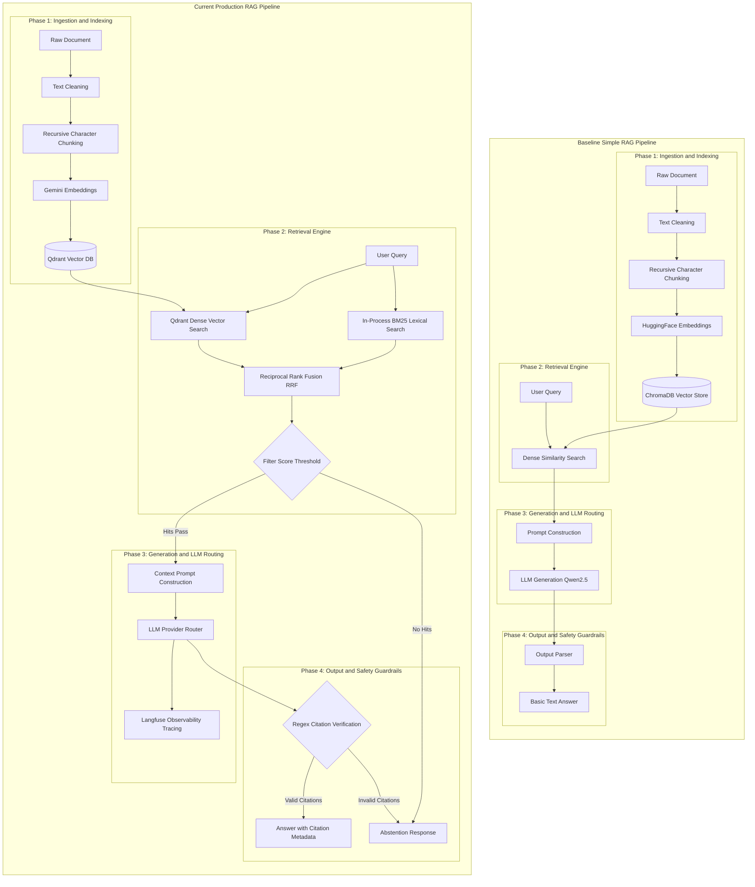

# RAG Pipeline Comparison: Simple RAG vs. Company Knowledge RAG

This document compares the baseline **Simple RAG Pipeline** (documented in [`Simple-RAG.pdf`](file:///e:/VIN-INTERNSHIP/Company-knowledge-RAG/docs/Simple-RAG.pdf)) with the current **Company Knowledge RAG** core pipeline.

---

## 1. Executive Summary & Pipeline Alignment

### Alignment Score: ~100% Core Conceptual Pipeline | Advanced Pipeline Features: +300%

| Pipeline Phase | Baseline Simple RAG | Current Production RAG Pipeline | Evolution & Enhancements |
| :--- | :--- | :--- | :--- |
| **1. Ingestion & Indexing** | PDF loading, text cleaning, Recursive Text Splitter, HuggingFace embeddings, ChromaDB vector store | Text loading, text cleaning, Recursive Text Splitter, Gemini embeddings (`gemini-embedding-001`), Qdrant Vector DB with status filtering | **Aligned & Enhanced**: Upgraded vector database & high-dimensional embeddings with state metadata. |
| **2. Retrieval Engine** | Single-stream Dense Similarity Search (Cosine / top-k=4) | **Hybrid Retrieval**: Parallel Qdrant Dense Search + In-process BM25 Lexical Search fused via **Reciprocal Rank Fusion (RRF k=60)** | **Major Upgrade**: Solves exact keyword matching limitations (names, technical terms, IDs) present in vector-only search. |
| **3. Generation & LLM Routing** | Single local HuggingFace LLM pipeline (`Qwen/Qwen2.5-3B-Instruct`) | Structured prompt with context isolation tags, dispatched via a **Provider Router** (Gemini, OpenRouter, OpenAI) | **Major Upgrade**: Context-isolated prompt engineering and resilient multi-provider fallback. |
| **4. Citation Verification & Safety** | Basic answer output parser (prefix stripping) | **Deterministic Citation Gating & Abstention Guard**: Regex verification of `[C1]`, `[C2]` citation tags + score gating | **Major Upgrade**: Eliminates hallucinations by forcing deterministic abstention if citations are missing or invalid. |

---

## 2. Side-by-Side RAG Pipeline Flowchart (Grouped by Phase)

The diagram below visualizes the pure **RAG algorithmic pipeline** with boxed area subgraphs for each of the 4 distinct RAG phases.

---

## 3. Detailed RAG Step Breakdown

### Phase 1: Ingestion & Indexing Pipeline
- **Baseline Alignment**: Both pipelines process source documents, normalize Vietnamese text (`NFC` normalization, stripping control characters), and split text using recursive character chunking with overlap.
- **Current Pipeline Enhancements**: Upgrades from local HuggingFace embeddings (`sentence-transformers/paraphrase-multilingual-MiniLM-L12-v2`) and ChromaDB to Gemini embeddings (`gemini-embedding-001`) and Qdrant Vector DB with metadata status filtering (`status == "ready"`).

### Phase 2: Retrieval Pipeline
- **Baseline**: Uses single-stream **Dense Similarity Search** via `ChromaDB` (Bi-Encoder embeddings only).
  - *Limitation*: Can miss exact product names, IDs, or domain jargon when vector representations are semantically close across different keywords.
- **Current Pipeline**: Implements **Hybrid Retrieval** combining Qdrant dense vector search with in-process BM25 lexical keyword search.
  - *Fusion*: Merges dense and lexical hit ranks using **Reciprocal Rank Fusion (RRF)**:
    $$\text{Score}(d) = \sum_{m \in \{\text{dense}, \text{lexical}\}} \frac{1}{60 + \text{rank}_m(d)}$$
  - *Gating*: Applies `min_dense_score` filtering before prompt rendering.

### Phase 3: Generation & Routing Pipeline
- **Baseline**: Passes context chunks into a basic `PromptTemplate` and generates text using a single local model (`Qwen2.5-3B-Instruct`).
- **Current Pipeline**: Wraps context chunks inside untrusted data blocks (`<context>` tags) in [`answer_v1.py`](file:///e:/VIN-INTERNSHIP/Company-knowledge-RAG/src/prompts/answer_v1.py). Dispatches prompts through a multi-provider **Router** ([`router.py`](file:///e:/VIN-INTERNSHIP/Company-knowledge-RAG/src/providers/router.py)) supporting Gemini, OpenRouter, and OpenAI with automatic retry failover.

### Phase 4: Citation Enforcement & Abstention Guard
- **Baseline**: Passes raw LLM text output directly through a simple string prefix parser. If the model hallucinates or invents ungrounded facts, the response is accepted.
- **Current Pipeline**: Implements **Deterministic Citation Gating** in [`service.py`](file:///e:/VIN-INTERNSHIP/Company-knowledge-RAG/src/generation/service.py):
  1. Mandates `[C1]`, `[C2]` inline citation tags for every factual claim.
  2. Extracts and validates tags against retrieved chunk indices.
  3. **Abstention Guard**: Overrides the answer with a standardized Vietnamese abstention string (*"Không tìm thấy thông tin phù hợp trong tài liệu được phép truy cập."*) if citations are missing, invalid, or ungrounded.

---

## 4. Summary of Pipeline Differences

1. **Foundational Alignment (~100%)**:
   The core RAG workflow (Indexing -> Hybrid/Dense Retrieval -> Context Prompting -> LLM Generation) is fully aligned with the baseline theory in `Simple-RAG.pdf`.

2. **Advanced Pipeline Upgrades**:
   - **Retrieval**: Dense-only → **Hybrid (Dense + BM25) + RRF**.
   - **Generation**: Single local model → **Multi-provider Failover Router**.
   - **Verification**: Basic string cleanup → **Regex Citation Verification & Abstention Guard**.
