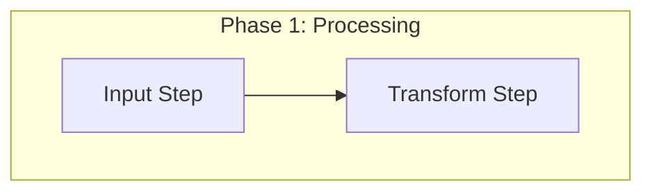

# Architecture Documentation Index & Agent Standard

> **System Overview Reference**: For the overall high-level system architecture overview, see the root [`RAG-ARCHITECTURE.md`](../../RAG-ARCHITECTURE.md). This directory (`docs/architectures/`) contains the deep-dive modular technical specifications.

---

## 1. Modular Architecture Document Index

The table below maps each detailed architecture file to its topic, primary focus, and underlying implementation files:

| File Name | Subsystem / Topic | Key Focus & Capabilities | Primary Implementation Files |
| :--- | :--- | :--- | :--- |
| [`01-system-context.md`](01-system-context.md) | System Context & Topology | High-level system context, entry points, component matrix | [`src/api/app.py`](../../src/api/app.py), [`src/ingestion/service.py`](../../src/ingestion/service.py) |
| [`02-document-loading-and-ingestion.md`](02-document-loading-and-ingestion.md) | Document Ingestion Pipeline | Document parsing, hashing, text cleaning, chunking | [`src/ingestion/service.py`](../../src/ingestion/service.py), [`src/storage/registry.py`](../../src/storage/registry.py) |
| [`03-indexing-storage-and-access-control.md`](03-indexing-storage-and-access-control.md) | Indexing & Storage Layer | Qdrant vector store, status flags (`ready`), persistence | [`src/retrieval/qdrant_store.py`](../../src/retrieval/qdrant_store.py) |
| [`04-retrieval-generation-and-citations.md`](04-retrieval-generation-and-citations.md) | Retrieval & Generation Engine | Hybrid search (RRF), prompt templates, citation gating | [`src/retrieval/hybrid.py`](../../src/retrieval/hybrid.py), [`src/generation/service.py`](../../src/generation/service.py) |
| [`05-observability-evaluation-and-operations.md`](05-observability-evaluation-and-operations.md) | Operations & Observability | Langfuse telemetry tracing, golden set benchmark runner | [`src/observability/tracing.py`](../../src/observability/tracing.py), [`src/evaluation/runner.py`](../../src/evaluation/runner.py) |
| [`06-simple-rag-vs-company-rag-comparison.md`](06-simple-rag-vs-company-rag-comparison.md) | RAG Pipeline Comparison | Baseline vs. Production RAG side-by-side comparison | All core pipeline files |
| [`../references/CHUNKING-AND-RETRIEVAL-FLOW.md`](../references/CHUNKING-AND-RETRIEVAL-FLOW.md) | Chunking and Retrieval Deep Dive *(Vietnamese)* | End-to-end walkthrough with real input/output at every stage; sibling expansion internals | [`src/ingestion/chunker.py`](../../src/ingestion/chunker.py), [`src/retrieval/hierarchical.py`](../../src/retrieval/hierarchical.py) |

---

## 2. Formatting & Structural Standard for Coding Agents

When creating or modifying documentation files in this directory, AI coding agents and human contributors MUST strictly follow these formatting rules:

### 2.1 File Naming Convention
- Files MUST follow the pattern: `NN-<topic-in-kebab-case>.md` (e.g., `07-new-feature-topic.md`).

### 2.2 Section Structure Hierarchy
Every document MUST contain the following sections in exact order:
1. `# <Descriptive Title>` (H1 heading at top).
2. `## Fresher AI Engineer Key Concepts` (H2 heading containing a GitHub alert `> [!NOTE]` explaining domain terminology simply).
3. `## Overview` or `## Purpose` (H2 summary of subsystem goals).
4. `## Component Matrix` or `## Detailed Workflow Steps` (H2 Markdown table linking code files and key interfaces).
5. `## Pipeline Architecture` or `## Diagram` (H2 Mermaid diagram visualizing data flow or topology).

### 2.3 Mermaid Syntax Guardrails
To prevent diagram rendering failures in IDEs and browsers:
- **Always double-quote node labels**: Use `Node["Text"]` or `Decision{"Text"}`.
- **Do NOT use unescaped brackets in decision nodes**:
  - ❌ `C_Verify{Regex Check [C1], [C2]}` → **Syntax Error!**
  - ✅ `C_Verify{"Regex Check (C1, C2)"}` → **Valid!**
- **Do NOT use unescaped HTML tags**: Replace `<context>` with `Context` or use `&lt;context&gt;`.
- **Do NOT use ampersands as word joiners**: Use `and` instead of `&` to prevent junction parsing errors.
- **Use Subgraph Phase Boxes**: Enclose multi-stage workflows in `subgraph Phase1["Phase 1: Title"]`.

### 2.4 Code Linking Standard
- File links MUST use relative paths pointing to `../../src/...`:
  - Example: [`src/generation/service.py`](../../src/generation/service.py)
- Symbols MUST use inline backticks: `IngestionService.ingest_bytes()`, `status == "ready"`.

---

## 3. Copy-Paste Starter Skeleton Template

When authoring a new document (e.g., `07-topic-name.md`), copy and populate the template below:

# [Subsystem Name] Architecture

## Fresher AI Engineer Key Concepts

> [!NOTE]
> **What is [Concept Name]?**  
> Explain the core domain concept simply in 2-3 sentences here.

## Purpose & Overview

Describe what this subsystem does, why it exists, and its core operational behavior.

## Component Matrix

| Subsystem / Module | Responsibility | Implementation File | Key Interfaces |
| :--- | :--- | :--- | :--- |
| **Component Name** | Description | [`src/path/file.py`](../../src/path/file.py) | `ClassName.method()` |

## Pipeline Architecture

