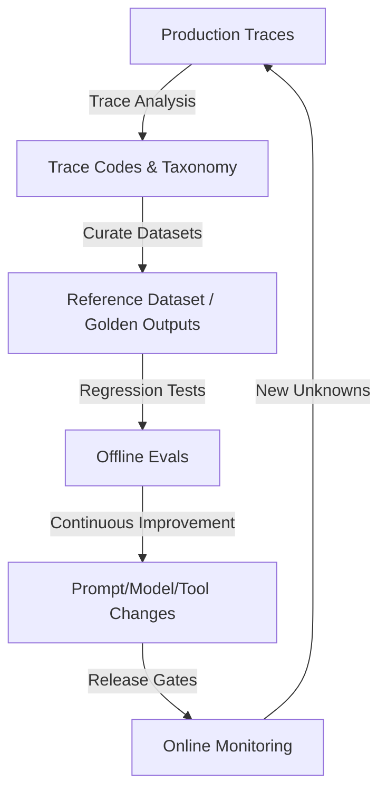
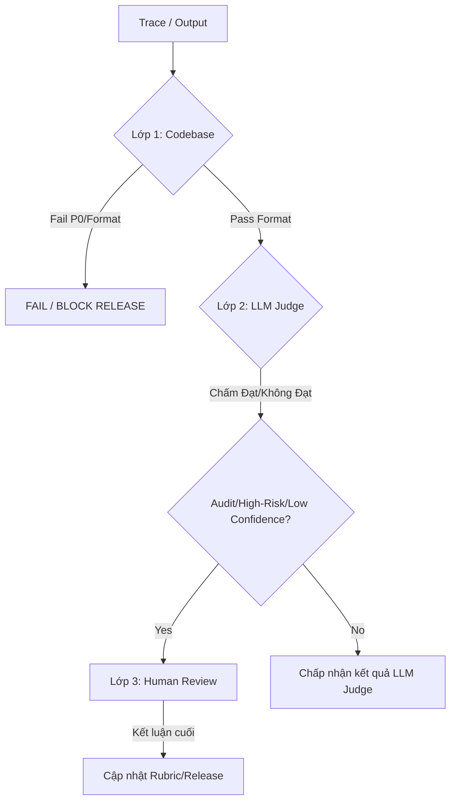

# Hướng Dẫn Toàn Diện Về Đánh Giá Hệ Thế AI (AI Evaluations - Evals)

Tài liệu này hệ thống hóa toàn bộ kiến thức về AI Evaluations (AI Evals) từ lý thuyết nền tảng, quy trình thiết kế dữ liệu, phân tích trace, kiến trúc hệ thống 3 lớp (Codebase - Con người - LLM) đến vận hành thực tế trong chu kỳ phát triển sản phẩm AI.

---

## 1. Tư Duy Nền Tảng (Core Mindset)

### 1.1. Thay Đổi Vai Trò Của AI Product Manager (Traditional vs AI-Native PM)
Trong phần mềm truyền thống, PM vận hành trong một thế giới **xác định (deterministic)** với các luồng người dùng cố định. Đối với sản phẩm AI, PM phải làm quen với thế giới **xác suất (probabilistic)**, quản lý sự phân bổ chất lượng đầu ra thay vì chỉ đo tỷ lệ chuyển đổi qua các bước.

| Đặc điểm | Phần mềm truyền thống (Traditional Product) | Sản phẩm AI (AI-Native Product) |
| :--- | :--- | :--- |
| **Tính chất hệ thống** | Xác định (Deterministic flow) | Xác suất (Probabilistic distribution) |
| **Chỉ số đo lường** | Usage metrics (Conversion, Retention, Funnel completion) | Quality metrics (Accuracy, Groundedness, Helpfulness, Safety) |
| **Trọng tâm PM** | Tối ưu luồng nhấp chuột (UI/UX Flows) | Quản lý sự phân bổ chất lượng (Quality Distributions) |
| **Hành vi khi lỗi** | Lỗi hệ thống rõ ràng (Crash, Bug logic) | Thất bại âm thầm (Silent failures, Hallucinations) |

### 1.2. Phân Biệt Model Evals vs Application Evals
*   **Model Evals (Đánh giá mô hình nền tảng):** Đo lường năng lực cơ bản (reasoning, coding, math, safety) trên các bộ benchmark tiêu chuẩn (MMLU, GSM8K). Đây là nhiệm vụ của nhà cung cấp mô hình (OpenAI, Anthropic, Google).
*   **Application Evals (Đánh giá ứng dụng AI):** Đo lường chất lượng đầu ra trong ngữ cảnh thực tế của người dùng và sản phẩm. Đây là nhiệm vụ của Product Team (PM, Engineer, Domain Expert) vì không có benchmark chung nào định nghĩa được thế nào là "đúng", "tốt" hay "đủ an toàn" cho doanh nghiệp của bạn.

### 1.3. Vòng Lặp Cải Nhiệm Liên Tục (AI Flywheel)
Sản phẩm AI không tự nhiên tuyệt vời ngay từ đầu. Chúng cần hệ thống Flywheel để liên tục thu thập dữ liệu và cải tiến:



---

## 2. Thiết Kế Tập Dữ Liệu Đánh Giá & Coverage

### 2.1. Thiết Kế Coverage qua User Input Grid
Thay vì tạo ngẫu nhiên hoặc dùng LLM tự tạo hàng trăm câu prompt giống nhau (hữu hình nhưng nghèo nàn context), PM cần chủ động thiết kế coverage bằng cách xây dựng **User Input Grid** dựa trên các chiều kích (dimensions) làm thay đổi hành vi của Agent:

1.  **WHO (Ai đang dùng?):** Persona, ICP (Khách hàng Pro vs Basic), trình độ chuyên môn.
2.  **WHAT (Ý định?):** User intent (Đổi hàng, tra cứu, hủy đơn).
3.  **HOW (Chất lượng đầu vào?):** 
    *   *Context richness:* Đầy đủ thông tin, thiếu thông tin hay mâu thuẫn.
    *   *Ambiguity:* Câu hỏi rõ ràng hay mơ hồ (nhiều cách hiểu).
    *   *Complexity:* Đơn intent hay đa intent, đơn bước hay đa bước.
4.  **CONTEXT (Môi trường?):** Ngôn ngữ (đa ngôn ngữ), vùng miền, múi giờ, phiên bản dữ liệu.
5.  **RISK (Rủi ro?):** Failure cost cao hay thấp, trạng thái phân quyền (permission state).
6.  **OUTPUT (Hành động mong đợi?):** Agent nên tự thực hiện (Act), hỏi lại (Ask) hay từ chối (Don't Act).

### 2.2. Ba Loại Scenarios Trong Dataset
*   **Representative Scenarios (Kịch bản đại diện):** Phản ánh đúng phân bổ phân phối thực tế trong production (ví dụ: các câu hỏi thường gặp).
*   **Challenge Scenarios (Kịch bản thử thách):** Cố ý phóng đại các trường hợp khó (ambiguous inputs, nguồn dữ liệu mâu thuẫn, retrieval zero-hit, multi-intent). Pass rate ở đây dùng để test độ bền bỉ, không đại diện cho success rate thực tế.
*   **Critical Regression Candidates (Kịch bản cấm sai):** Các lỗi nghiêm trọng từng xảy ra trong quá khứ hoặc vi phạm bảo mật/pháp lý nghiêm trọng (ví dụ: lộ thông tin thẻ, hứa hoàn tiền sai quy trình). Tuyệt đối không được phép fail lại sau mỗi lần nâng cấp.

### 2.3. Bài Học Thực Tế Từ Notion AI
*   **Quality over Quantity:** Bắt đầu nhỏ với **10 samples** nhưng chuẩn định dạng (format) và đa dạng ngữ cảnh hơn là tạo ra 1000 dummy data sai lệch.
*   **Dog-fooding & Thumbs-down data:** Thu thập các câu lệnh tự nhiên thực tế của người dùng thông qua feedback tiêu cực (thumbs-down) nội bộ và ngoại bộ. Request thật của người dùng là tài sản dài hạn dùng để test mọi thế hệ model sau này.
*   **Kích thước dataset theo giai đoạn:**
    *   *Vibe Check:* 10 - 30 cases.
    *   *Initial Offline Eval:* 50 - 100 cases.
    *   *Mature Offline Eval:* 200 - 1000+ cases.

---

## 3. Phân Tích Trace & Chuẩn Hóa Lỗi (Trace Analysis & Taxonomy)

### 3.1. Phân Biệt Transcript vs Trace
*   **Transcript:** Nội dung hội thoại thô hiển thị với người dùng (Input -> Output). Chỉ đọc transcript không đủ vì kết quả trông có vẻ ổn nhưng bên dưới hệ thống có thể chạy sai logic.
*   **Trace:** Bản ghi chi tiết toàn bộ tiến trình nội bộ của Agent: system prompt, cấu hình model, context retrieved, các API/tool calls (input/output của tool), các bước reasoning trung gian, độ trễ (latency), chi phí (token/cost) và metadata.

### 3.2. Quy Trình Phân Tích Trace (Discovery to Rubric)
```
[Chạy test suite] ➔ [Đọc trace & ghi nhận tự do] ➔ [Gom nhóm các pattern lặp lại] ➔ [Xác định nguyên nhân gốc (Root-cause)] ➔ [Chuẩn hóa thành Trace Codes & Rubric]
```

### 3.3. Hệ Thống Phân Loại Lỗi (Failure Mode Taxonomy)
PM không nên sao chép bảng phân loại lỗi từ dự án khác mà cần xây dựng dựa trên đặc thù sản phẩm. Một taxonomy chuẩn hóa thường bao gồm:

*   **Task Understanding (Hiểu tác vụ):** `wrong_intent` (hiểu sai ý định), `missed_intent` (bỏ sót ý định phụ), `wrong_category` (phân sai nhóm).
*   **Factuality (Độ chính xác):** `hallucination` (bịa đặt thông tin), `unsupported_claim` (nói ý không có trong context/grounding), `stale_information` (dữ liệu cũ).
*   **Tool Use (Sử dụng công cụ):** `wrong_tool` (gọi sai tool), `missing_tool_call` (không gọi tool cần thiết), `unnecessary_tool_call` (gọi thừa), `tool_result_ignored` (phớt lờ kết quả trả về từ tool).
*   **Policy & Safety (Chính sách):** `privacy_leak` (lộ UUID/PII), `permission_violation` (vượt quyền truy cập dữ liệu), `unsafe_advice` (khuyên bậy), `missed_escalation` (không chuyển người hỗ trợ khi cần).
*   **Output Quality (Chất lượng đầu ra):** `invalid_schema` (sai định dạng cấu trúc), `poor_tone` (giọng văn thiếu đồng cảm), `too_verbose` (dài dòng), `not_actionable` (không hướng dẫn bước tiếp theo).
*   **Reliability (Vận hành):** `timeout`, `high_latency`, `high_cost`, `nondeterministic_regression`.

### 3.4. Định Nghĩa Độ Nghiêm Trọng (Severity Levels)
*   **P0 (Cực kỳ nghiêm trọng):** Gây hại người dùng, lộ bảo mật/PII, thực hiện giao dịch tài chính trái phép, vi phạm pháp lý.
*   **P1 (Nghiêm trọng):** Chuyển nhầm phòng ban hỗ trợ, bỏ sót yêu cầu khẩn cấp (missed escalation), trả lời sai nghiêm trọng kiến thức cốt lõi.
*   **P2 (Trung bình):** Gây bối rối nhưng người dùng tự khắc phục được, lỗi factual nhỏ, lỗi định dạng nhẹ.
*   **P3 (Thấp):** Lỗi hành văn, dài dòng, giọng văn chưa tối ưu.

---

## 4. Ba Lớp Đánh Giá (Three Layers of Evaluation)

Nguyên tắc cốt lõi: **"Codebase chấm cái chắc chắn. Con người định nghĩa cái đúng. LLM scale cái đã được con người định nghĩa và kiểm định."**



### 4.1. Lớp 1 - Codebase & Deterministic Checks (Mặc Định Ưu Tiên)
Là nền tảng của eval suite. Cực kỳ nhanh, rẻ, ổn định 100% và chạy tự động trong CI/CD.
*   **Đối tượng áp dụng:** JSON Schema, cấu trúc Enum, định dạng chuỗi regex (UUID, token, email), kiểm tra quyền (RBAC check), truy vấn database để so khớp dữ liệu thật, kiểm tra sự tồn tại của nguồn trích dẫn (RAG citations metadata), độ trễ (latency) và chi phí.
*   **Hạn chế:** Không chấm được ngữ nghĩa tinh tế, sự đồng cảm và sắc thái ngôn ngữ.

### 4.2. Lớp 2 - Con Người (Human Evaluation - Tiêu Chuẩn Vàng)
Con người (Domain Expert) là nguồn chuẩn (Ground Truth) để định nghĩa thế nào là "tốt" trước khi tự động hóa.
*   **Đối tượng áp dụng:** Giai đoạn prototype khi chưa rõ lỗi gì; dán nhãn bộ dữ liệu mẫu (Golden Outputs); đánh giá các tác vụ high-stakes (pháp lý, y tế); hiệu chỉnh (calibration) bộ chấm điểm LLM.
*   **Hỗ trợ phân nhóm đánh giá đơn giản:** `Good (Ship)` / `Needs Minor Fix` / `Bad (Fail)`.
*   **Chiến lược lấy mẫu (Sampling):** Không lấy mẫu ngẫu nhiên 100%. Phối hợp: Random sample (đo tổng quan) + High-risk sample (kiểm toán bảo mật/tài chính) + Low-confidence/Disagreement sample (những case LLM Judge chấm mâu thuẫn/không chắc chắn).

### 4.3. Lớp 3 - LLM-as-Judge / Model-based Evaluation (Mở Rộng Quy Mô)
Sử dụng LLM làm trọng tài để chấm điểm ngữ nghĩa ở quy mô lớn sau khi đã được con người căn chỉnh.
*   **Đối tượng áp dụng:** Chấm tính hữu ích (helpfulness), độ tương thích ngữ cảnh (groundedness), giọng văn (tone/empathy), độ mạch lạc của lập luận.
*   **Điều kiện cần có trước khi dùng LLM Judge:** Rubric cụ thể + Ví dụ tốt/xấu + Tập dữ liệu căn chỉnh (Calibration set) có nhãn của con người.
*   **Đo lường năng lực của LLM Judge:** Không chỉ đo tỷ lệ đồng thuận thô (raw agreement rate). Bắt buộc phải tính **Precision (Độ chính xác)** và **Recall (Độ nhạy)** trên tập lỗi để tránh tình trạng Judge quá dễ dãi (False Negative cao - lọt lỗi xấu ra production).

#### Quy Trình 6 Bước Calibration (Hiệu Chỉnh Trọng Tài LLM):
1.  **Chọn 50-100 traces** đại diện (đầy đủ case dễ, khó, mơ hồ).
2.  **Expert gắn nhãn** thủ công (Pass/Fail) kèm lý do.
3.  **Chạy LLM Judge** trên tập này, lưu lại kết quả và reasoning string.
4.  **So sánh bất đồng (Disagreement):** Tìm điểm lệch (ví dụ: Judge chấm quá lỏng lẻo đối với lỗi hallucination).
5.  **Sửa Prompt của LLM Judge:** Bổ sung ví dụ cụ thể, làm chặt chẽ tiêu chí chấm dựa trên các case bị lệch.
6.  **Kiểm tra trên tập riêng (Validation set)** để tạo baseline mới. Lặp lại nếu chưa đạt độ chuẩn xác mong muốn.

#### Khi Nào LLM Judge Chạm Trần (Không Cải Thiện Thêm Được Bằng Prompt)?
*   Model thiếu năng lực domain chuyên sâu (ví dụ: model thông thường chấm lỗi chẩn đoán y khoa hoặc điều khoản luật phức tạp).
*   Đã chỉnh sửa prompt qua nhiều vòng nhưng chỉ số F1-score/Recall không tăng.
*   Ngay cả chuyên gia con người cũng không thống nhất được case đó đúng hay sai (tiêu chí quá mơ hồ ➔ cần định nghĩa lại quality bar).

---

## 5. Vòng Đời Đánh Giá (AI Evals Lifecycle Stages)

### Giai đoạn 1: Vibe Check (Khám Phá Hành Vi)
*   **Mục tiêu:** Tạo trực giác (intuition) về hành vi của AI trước khi viết PRD.
*   **Workflow:** Tạo 10-30 kịch bản đầu vào ➔ Chạy qua prototype ➔ Tự đọc tay toàn bộ trace và dán nhãn ✓/~/✗ ➔ Phân tích các failure patterns lặp lại để chuyển thành yêu cầu sản phẩm ➔ Chọn ra các output xuất sắc để làm **Golden Outputs** phục vụ few-shot learning và tập dữ liệu eval sau này.

### Giai đoạn 2: Offline Evals (Kiểm Soát Trước Release)
*   **Mục tiêu:** Đo lường sự cải tiến, phát hiện lỗi thụt lùi (regression check) trước khi triển khai thực tế.
*   **Workflow:** Thay đổi prompt/model/code ➔ Chạy tự động eval suite trên Reference Dataset ➔ Chạy các bộ codebase assertions trước ➔ Chạy LLM Judge ➔ So sánh chỉ số (Accuracy, Latency, Cost, Regression count) với Baseline (phiên bản đang chạy trên production) ➔ Áp dụng **Release Gate** để quyết định Deploy hay Block.

### Giai đoạn 3: Online Monitoring (Đo Lường & Flywheel Thực Tế)
*   **Mục tiêu:** Phát hiện sự trôi lệch phân phối dữ liệu (data drift), bắt các lỗi chưa từng thấy (unknown unknowns) khi có lượng user thực tế đông hơn.
*   **Workflow:** Log đầy đủ traces ➔ Theo dõi các tín hiệu gián tiếp (thumbs-down, hành động sửa prompt/retry của user, tỷ lệ chuyển tiếp nhân viên hỗ trợ) ➔ Lấy mẫu trace bị lỗi đưa ngược lại Reference Dataset để tối ưu liên tục.

---

## 6. Thiết Kế Metrics & Kiến Trúc Hệ Hệ Thống

### 6.1. Chỉ Số Tối Thượng: Agent Success Rate
Không sử dụng một chỉ số đơn lẻ (như accuracy thô) cho toàn bộ hệ thống Agent. PM cần xây dựng một chỉ số hỗn hợp (Composite Metric) dựa trên mức độ hoàn thành nhiệm vụ và trải nghiệm người dùng.

$$\text{Agent Success Rate} = f(\text{task\_success}, \text{user\_feedback}, \text{policy\_compliance}, \text{semantic\_quality})$$

### 6.2. Thiết Kế Cơ Sở Dữ Liệu Cho Hệ Thống Eval
Để lưu trữ và phân tích sự thay đổi chất lượng qua các phiên bản, kiến trúc DB cần tối thiểu 3 bảng:

```sql
-- 1. Lưu các kịch bản test chuẩn hóa
CREATE TABLE eval_cases (
  eval_case_id VARCHAR(50) PRIMARY KEY,
  feature VARCHAR(50) NOT NULL,
  intent VARCHAR(50),
  persona VARCHAR(50),
  risk_level VARCHAR(20),
  input JSONB NOT NULL,
  context JSONB,
  expected JSONB,
  judge_rubric_id VARCHAR(50),
  is_golden BOOLEAN DEFAULT FALSE,
  created_at TIMESTAMPTZ DEFAULT NOW()
);

-- 2. Lưu thông tin đợt chạy eval (CI build, local test,...)
CREATE TABLE eval_runs (
  eval_run_id VARCHAR(50) PRIMARY KEY,
  eval_suite VARCHAR(50) NOT NULL,
  model_version VARCHAR(50),
  prompt_version VARCHAR(50),
  code_version VARCHAR(50),
  started_at TIMESTAMPTZ DEFAULT NOW(),
  completed_at TIMESTAMPTZ,
  status VARCHAR(20)
);

-- 3. Lưu kết quả chi tiết từng case trong mỗi run
CREATE TABLE eval_results (
  eval_result_id VARCHAR(50) PRIMARY KEY,
  eval_run_id VARCHAR(50) REFERENCES eval_runs(eval_run_id),
  eval_case_id VARCHAR(50) REFERENCES eval_cases(eval_case_id),
  output JSONB,
  deterministic_checks JSONB,
  llm_judge_result JSONB,
  human_review_result JSONB,
  final_outcome VARCHAR(20), -- PASS / FAIL / NEEDS_REVIEW
  severity VARCHAR(10),       -- P0 / P1 / P2 / P3
  failure_modes VARCHAR(50)[],
  latency_ms INTEGER,
  cost_usd NUMERIC,
  created_at TIMESTAMPTZ DEFAULT NOW()
);
```

---

## 7. Các Anti-patterns Cần Tránh Khi Triển Khai

1.  **Chỉ vibe check rồi ship:** Vibe check chỉ dùng làm trực giác ban đầu. Nếu không có dataset cố định và chạy regression test tự động, bạn sẽ không thể kiểm soát chất lượng khi người dùng tăng lên hoặc khi đổi model.
2.  **Một điểm số "correctness" chung chung:** Điểm correctness trung bình che giấu các lỗi nghiêm trọng. Cần chia nhỏ theo khía cạnh (format compliance, grounding accuracy, safety, tone).
3.  **Dùng LLM Judge mà không calibration:** Tạo ra cảm giác tự tin giả tạo (false confidence). LLM Judge chưa hiệu chuẩn có xu hướng quá dễ dãi và bỏ qua lỗi nghiêm trọng.
4.  **Bắt con người chấm các lỗi deterministic:** Dùng sức người để kiểm tra JSON schema, kiểm tra xem có thiếu trường bắt buộc hay không là sự lãng phí nghiêm trọng. Những thứ này thuộc về Codebase.
5.  **Bỏ rơi dataset (Dataset chết):** Môi trường production luôn thay đổi. Nếu Reference Dataset không được cập nhật định kỳ từ các lỗi thực tế (production failures), hệ thống eval sẽ nhanh chóng mất đi tính đại diện.

---

## 8. Mẫu Hợp Đồng Eval Cho Sản Phẩm AI (AI Eval Contract PRD Template)

Đây là tài liệu bắt buộc PM và Tech Lead cần thống nhất trước khi tiến hành tối ưu hóa hệ thống AI.

```markdown
# AI Eval Contract: [Tên Tính Năng]

## 1. AI Work Unit
Mô tả cụ thể phần việc AI chịu trách nhiệm thực hiện, giới hạn đầu vào và đầu ra.

## 2. User & Context
Ai sử dụng? Trong hoàn cảnh nào? Yêu cầu ràng buộc phi chức năng (latency, cost) là gì?

## 3. Output Contract (Ràng buộc đầu ra)
- Định dạng bắt buộc (JSON Schema / Enum).
- Các trường thông tin bắt buộc phải xuất hiện.

## 4. Quality Dimensions (Khía cạnh chất lượng)
Định nghĩa chi tiết về: Correctness, Groundedness, Safety/Policy, Tone, Tool Usage,...

## 5. Must / Should / Must Not Rules
- **MUST:** (Ví dụ: Phải trích dẫn nguồn đúng ID).
- **SHOULD:** (Ví dụ: Câu trả lời nên ngắn gọn dưới 3 câu).
- **MUST NOT:** (Ví dụ: Không được lộ mã bí mật hệ thống).

## 6. Failure Modes & Severity Taxonomy
Bảng định nghĩa tên lỗi cụ thể trong use case này và phân loại độ nghiêm trọng (P0 - P3).

## 7. Reference Dataset Strategy
Quy mô dữ liệu (bao nhiêu kịch bản), nguồn dữ liệu (logs thực tế hay synthetic data), độ phủ các segment người dùng.

## 8. Eval Methods Matrix
Bảng phân vai công cụ chấm cho từng tiêu chí chất lượng:
| Dimension | Codebase assertion | LLM Judge | Human Review |
| :--- | :--- | :--- | :--- |
| Schema & Format | Trọng tâm chính | Không áp dụng | Không áp dụng |
| Groundedness | Check citation ID | Check ý nghĩa ngữ nghĩa | Hiệu chuẩn (Calibration) |
| Tone & Empathy | Không áp dụng | Trọng tâm (đã calib) | Nhãn chuẩn vàng ban đầu |

## 9. Release Gate Requirements
Định nghĩa ngưỡng chặn cụ thể để cho phép deploy:
- Không được phép có lỗi P0.
- Số lượng lỗi P1 không vượt quá phiên bản baseline.
- Tỷ lệ pass schema phải đạt trên 99.5%.

## 10. Monitoring & Flywheel Plan
Chiến lược lấy mẫu audit hàng tuần, giám sát drift giữa offline và online score.
```

---

## 9. Kết Luận Thực Dụng

> **"Codebase chấm cái chắc chắn. Con người định nghĩa cái đúng. LLM scale cái đã được con người định nghĩa và kiểm định."**

Một hệ thống AI Eval thành công không nằm ở việc sở hữu một dashboard lộng lẫy hay thư viện phức tạp. Nó nằm ở năng lực trả lời nhanh chóng và đáng tin cậy 5 câu hỏi cốt lõi sau đây sau mỗi lần cập nhật code hay prompt:
1.  *Phiên bản mới có tốt hơn phiên bản cũ không?*
2.  *Nó cải thiện ở phân khúc người dùng nào và làm tệ đi ở đâu?*
3.  *Lỗi nghiêm trọng nhất đang gặp phải là gì?*
4.  *Hệ thống có đủ điều kiện an toàn để triển khai (ship) không?*
5.  *Nếu không ship, chúng ta cần sửa đổi cấu phần nào (prompt, model, tool, retrieval, policy hay logic codebase)?*
