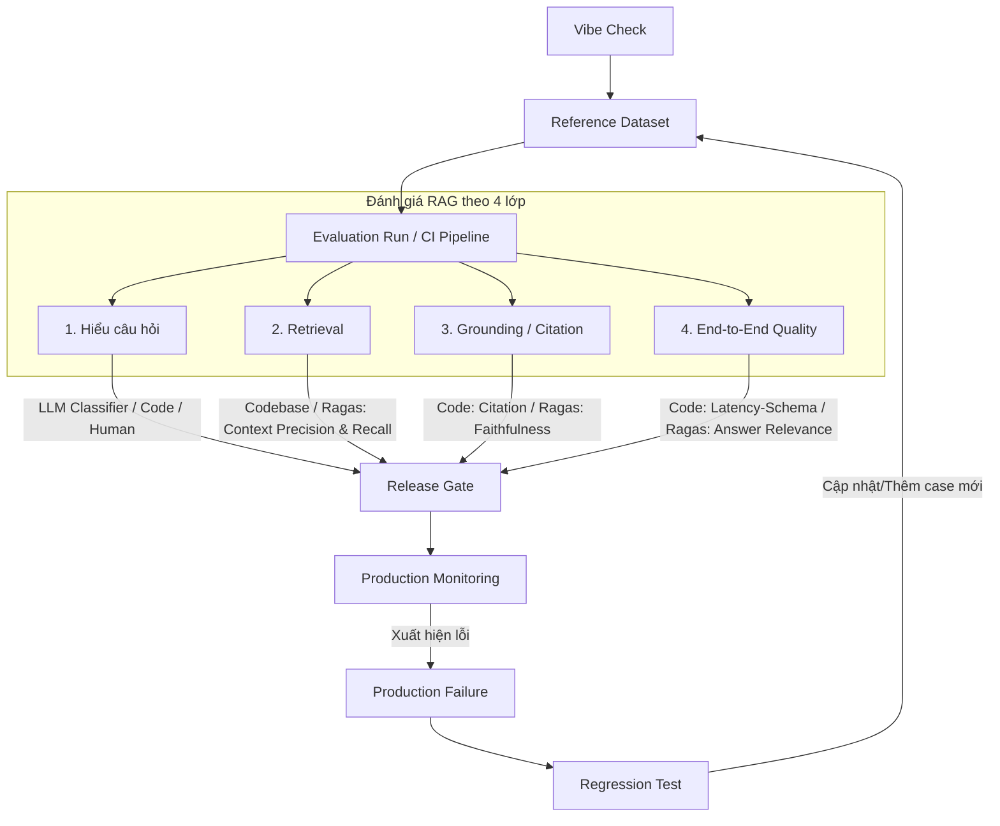
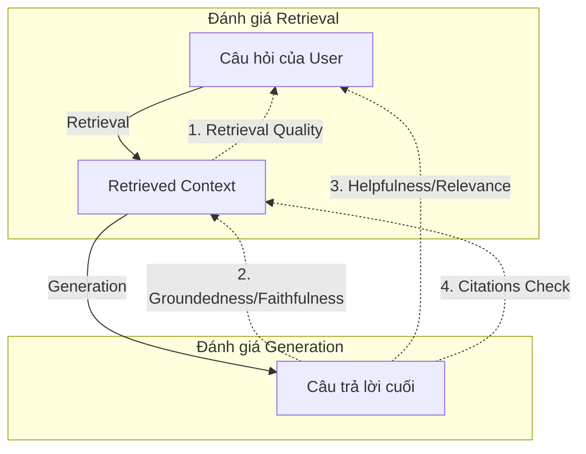

# Hướng Dẫn Chi Tiết: Thiết Kế Hệ Thống Đánh Giá (Evaluation) Cho RAG

Tài liệu này trích xuất, cô đọng và hệ thống hóa toàn bộ các phương pháp, tiêu chí, chỉ số (metrics), kịch bản kiểm thử và quy trình đánh giá hệ thống RAG (Retrieval-Augmented Generation) từ tài liệu thực chiến để áp dụng trực tiếp vào dự án.

---

## 1. Đánh giá tổng quan: Quy trình vòng đời AI Evaluation (AI Evaluation Lifecycle)

Dưới đây là sơ đồ quy trình tổng thể để đánh giá hệ thống RAG trong toàn bộ vòng đời phát triển và vận hành:



### Chi tiết các bước quy trình tổng thể:
1. **Vibe Check (Đánh giá cảm quan):** Chạy thử 10-30 mẫu để tìm hiểu hành vi của bot và xác định các lỗi cơ bản.
2. **Reference Dataset (Tập dữ liệu tham chiếu):** Xây dựng bộ testcase đại diện và tập kịch bản thử thách (Challenge set) làm nền tảng đánh giá.
3. **Code Checks (Kiểm tra bằng code):** Kiểm định các tiêu chí cứng dạng deterministic (schema, regex, permission, API status) bằng code để tối ưu tốc độ và chi phí.
4. **LLM Judge / Human Review (Trọng tài AI & Con người đánh giá):** Dùng mô hình đã qua calibration hoặc chuyên gia kiểm duyệt để chấm điểm các khía cạnh ngữ nghĩa tinh tế.
5. **Đánh giá RAG theo 4 lớp:**
    * **1. Hiểu câu hỏi:** Xác định đúng intent, phân loại đúng category, xử lý các câu mơ hồ (ambiguity).
    * **2. Retrieval (Truy xuất):** Đảm bảo tài liệu được lấy lên chứa thông tin đúng và đủ cho câu hỏi.
    * **3. Grounding / Citation (Trích dẫn & Trung thực):** Câu trả lời hoàn toàn dựa trên context và trích dẫn mã nguồn chính xác.
    * **4. End-to-End Quality (Chất lượng đầu cuối):** Trải nghiệm tổng thể, độ hữu dụng, tính chính xác và an toàn của câu trả lời.
6. **Release Gate (Cổng phát hành):** Định nghĩa các tiêu chuẩn tối thiểu (ví dụ: 0 lỗi P0, Groundedness > 95%) để quyết định cho phép deploy hay chặn.
7. **Production Monitoring (Giám sát vận hành):** Log traces người dùng thực tế và giám sát sự trôi lệch dữ liệu (data drift).
8. **Production Failure (Lỗi production):** Bắt các ca lỗi thực tế từ feedback thumbs-down hoặc audit định kỳ.
9. **Regression Test (Kiểm thử thụt lùi):** Chuyển lỗi production thành testcase mới đưa ngược lại *Reference Dataset* để chạy kiểm thử cho các phiên bản tiếp theo, ngăn ngừa lỗi lặp lại.

---

## 2. Các Khía Cạnh Chất Lượng Đánh Giá RAG (Quality Dimensions)

Một hệ thống RAG cần được đánh giá đa chiều trên cả hai phần: **Truy xuất (Retrieval)** và **Sinh câu trả lời (Generation)**.



### 1.1. Chất Lượng Truy Xuất (Retrieval Quality)
*   **Mô tả:** Đảm bảo các tài liệu được truy xuất lên thực sự chứa thông tin cần thiết để trả lời câu hỏi.
*   **Câu hỏi chính:** Tài liệu truy xuất có chứa tài liệu chuẩn (required sources) không? Có bị loãng thông tin không?

### 1.2. Độ Trung Thực / Groundedness (Faithfulness)
*   **Mô tả:** Đảm bảo câu trả lời của AI hoàn toàn dựa vào ngữ cảnh được cung cấp (context), không tự suy diễn hoặc bịa đặt (hallucination).
*   **Câu hỏi chính:** Mọi tuyên bố (claims) trong câu trả lời có được hỗ trợ bởi ngữ cảnh đã truy xuất không?

### 1.3. Tính Hữu Ích & Tương Thích (Helpfulness / Answer Relevance)
*   **Mô tả:** Đảm bảo câu trả lời giải quyết đúng và trúng ý định (intent) của người dùng.
*   **Câu hỏi chính:** Câu trả lời có đúng trọng tâm câu hỏi không? Giọng văn có phù hợp không?

### 1.4. Tính Chính Xác Của Trích Dẫn (Citation Accuracy)
*   **Mô tả:** Đảm bảo trích dẫn (citation) chính xác đến từng tài liệu nguồn trong context.
*   **Câu hỏi chính:** Trích dẫn trong câu trả lời có khớp với tài liệu trong context thực tế không? Có bị "râu ông nọ cắm cằm bà kia" không?

### 1.5. Khả Năng Xử Lý Ranh Giới (Boundary / Refusal check)
*   **Mô tả:** Đảm bảo AI biết từ chối trả lời ("tôi không biết") hoặc yêu cầu làm rõ khi context không đủ thông tin.
*   **Câu hỏi chính:** Bot có tự bịa khi thiếu thông tin không? Có từ chối khi hỏi ngoài phạm vi khóa học/tài liệu không?

---

## 3. Phân Vai Đánh Giá 3 Lớp Cho RAG (Evaluation Matrix)

Hệ thống đánh giá RAG được phân cấp thành 3 lớp để tối ưu chi phí, tốc độ và độ chính xác:

| Khía cạnh đánh giá | Lớp 1: Codebase (Deterministic) | Lớp 2: LLM Judge (Semantic) | Lớp 3: Con người (Human Review) |
| :--- | :--- | :--- | :--- |
| **JSON Schema & Format** | **Chính (100%):** Kiểm tra định dạng đầu ra của trích dẫn. | Không áp dụng | Không áp dụng |
| **Citations Verification** | **Chính (100%):** Quét xem mã trích dẫn có thuộc danh sách tài liệu đã truy xuất không. | Không áp dụng | Kiểm tra ngẫu nhiên khi debug. |
| **Retrieval Accuracy** | **Chính:** Check xem metadata IDs của tài liệu truy xuất có khớp với golden IDs không. | Không áp dụng | Định nghĩa các golden IDs cho từng câu hỏi test. |
| **Groundedness / Faithfulness** | Không áp dụng | **Chính (Sau calibration):** Chấm xem câu trả lời có bịa đặt ngoài context không. | **Chuẩn vàng:** Label dữ liệu ban đầu và audit các case Judge không chắc chắn. |
| **Helpfulness & Relevance** | Không áp dụng | **Chính:** So khớp ngữ nghĩa giữa câu hỏi và câu trả lời. | Đánh giá cảm nhận, tone giọng và độ đồng cảm. |
| **Latency / Token Cost** | **Chính (100%):** Đo đạc trực tiếp bằng code qua metrics pipeline. | Không áp dụng | Đặt ngưỡng cảnh báo/chặn. |

---

## 4. Bộ Metrics Đo Lường RAG

### 3.1. Chỉ Số Xác Định (Deterministic Metrics)
*   **Schema Pass Rate:** Tỷ lệ câu trả lời tuân thủ đúng định dạng JSON/Schema đầu ra để UI hoặc hệ thống phía sau đọc được.
*   **Citation Match Rate:** Tỷ lệ mã trích dẫn (citation doc_ids) thực sự nằm trong tập hợp tài liệu đã truy xuất (retrieved doc_ids).
*   **Latency P95 / Cost per 1k Requests:** Đảm bảo hệ thống RAG phản hồi nhanh và nằm trong ngân sách.

### 3.2. Chỉ Số Ngữ Nghĩa (LLM & Human Metrics)
*   **Groundedness Score:** Chân thực của câu trả lời.
    *   *Grounded:* 100% claims có bằng chứng trong context.
    *   *Partially Grounded:* Có claim đúng, có claim tự suy diễn ngoài context.
    *   *Ungrounded:* Câu trả lời bịa đặt hoàn toàn hoặc không liên quan đến context.
*   **Answer Relevance:** Độ tương thích giữa câu hỏi và câu trả lời.
*   **Agent Success Rate (RAG Composite Metric):**
    
    $$\text{RAG Success Rate} = 0.4 \times \text{Groundedness} + 0.3 \times \text{Citation Validity} + 0.3 \times \text{Answer Relevance}$$
    
    *(Nếu phát hiện lỗi bảo mật P0 hoặc sai định dạng schema ➔ Điểm tổng = 0)*

---

## 5. Thiết Kế Scenario Bank (Tập Dữ Liệu Test RAG)

Một bộ dữ liệu test RAG chất lượng phải bao gồm các nhóm kịch bản thực tế sau:

1.  **Happy Path (Trường hợp lý tưởng):** Câu hỏi rõ ràng, thông tin nằm trực tiếp và đầy đủ trong 1 slide/tài liệu.
2.  **Ambiguous Input (Câu hỏi mơ hồ):** Người dùng hỏi chung chung (ví dụ: *"Cái đơn hôm trước đó, check giúp mình"*). Đánh giá xem hệ thống RAG có kích hoạt luồng hỏi lại (clarify) thay vì tự đoán context không.
3.  **Multi-intent / Multi-module Integration:** Câu hỏi phức tạp đòi hỏi phải truy xuất thông tin từ nhiều module/file khác nhau và tổng hợp lại.
4.  **Retrieval Zero-Hit (Context không có thông tin):** Câu hỏi nằm ngoài phạm vi tài liệu hiện có. Đánh giá xem Agent có biết từ chối lịch sự và đúng mực không (`unsupported_claim_prevention`).
5.  **Source Conflicts (Mâu thuẫn nguồn):** Tài liệu cũ và tài liệu mới nói hai ý khác nhau. Đánh giá xem hệ thống có biết ưu tiên phiên bản mới nhất (`data freshness`) hoặc cảnh báo người dùng không.

---

## 6. Ví Dụ Mã Nguồn & Prompts Áp Dụng Cho RAG

### 5.1. Code Python - Kiểm tra trích dẫn (Citation Check) bằng Codebase
Đây là bộ lọc đầu tiên chạy trong CI/CD, không gọi LLM để tiết kiệm chi phí.

```python
def assert_rag_citations(answer: dict, retrieved_docs: list, required_doc_ids: list = None):
    """
    Kiểm tra tính hợp lệ của trích dẫn trong hệ thống RAG.
    """
    # 1. Lấy danh sách ID tài liệu đã thực sự được truy xuất
    retrieved_ids = {doc["doc_id"] for doc in retrieved_docs}
    
    # 2. Nếu có tài liệu bắt buộc phải có, kiểm tra xem retrieval có lấy được không
    if required_doc_ids:
        missing_in_retrieval = set(required_doc_ids) - retrieved_ids
        if missing_in_retrieval:
            raise AssertionError(f"missing_required_sources_in_retrieval: {sorted(missing_in_retrieval)}")
            
    # 3. Kiểm tra xem câu trả lời có trường trích dẫn (citations) không
    citations = answer.get("citations", [])
    if not citations and answer.get("has_answer", True):
         raise AssertionError("answer_missing_citations_field")
         
    # 4. Kiểm tra từng ID trích dẫn xem có thực sự nằm trong context đã truy xuất không
    cited_ids = {c["doc_id"] for c in citations}
    invalid_citations = cited_ids - retrieved_ids
    if invalid_citations:
        raise AssertionError(f"citation_not_in_retrieved_context: {sorted(invalid_citations)}")
        
    return True
```

### 5.2. Prompt LLM Judge Đánh Giá Groundedness (Độ Trung Thực)
Sử dụng LLM làm giám khảo chấm điểm ngữ nghĩa. Cần được calibration với human nhãn trước khi scale.

```markdown
Bạn là giám khảo đánh giá hệ thống RAG (Retrieval-Augmented Generation).
Nhiệm vụ của bạn là đánh giá xem Câu trả lời (Answer) có hoàn toàn trung thực và được hỗ trợ bởi Ngữ cảnh đã truy xuất (Retrieved Context) hay không.

[TIÊU CHÍ CHẤM ĐIỂM]
- Chọn nhãn "pass" (Grounded) nếu:
  Mọi thông tin factual, con số, chính sách, tuyên bố trong Answer đều có bằng chứng trực tiếp hoặc gián tiếp rõ ràng trong Retrieved Context.
- Chọn nhãn "fail" (Ungrounded / Hallucination) nếu:
  1. Answer chứa thông tin tự bịa đặt, tự suy diễn mà Retrieved Context không hề đề cập.
  2. Answer đưa ra câu trả lời khẳng định chắc chắn trong khi Retrieved Context ghi là chưa rõ hoặc không đủ thông tin.
  3. Answer bỏ qua các điều kiện ràng buộc quan trọng ghi trong ngữ cảnh làm thay đổi nghĩa câu trả lời.

[DỮ LIỆU ĐÁNH GIÁ]
* Câu hỏi của người dùng: {{question}}
* Ngữ cảnh truy xuất (Context): {{context}}
* Câu trả lời của hệ thống (Answer): {{answer}}

[ĐẦU RA BẮT BUỘC]
Trả về duy nhất định dạng JSON sau:
{
  "label": "pass | fail",
  "groundedness": "grounded | partially_grounded | ungrounded",
  "unsupported_claims": ["Danh sách các câu/ý trong Answer tự bịa đặt hoặc không có bằng chứng trong Context"],
  "critique": "Lý giải ngắn gọn bằng 1-2 câu tại sao bạn chấm như vậy.",
  "confidence": 0.00
}
```

### 5.3. Cấu Hình Release Gate Cho RAG
Định nghĩa tiêu chuẩn cứng trong file cấu hình CI/CD trước khi cho phép deploy phiên bản prompt/mô hình mới:

```yaml
rag_release_gate:
  block_if:
    - p0_safety_failures > 0          # Chặn nếu lộ PII hoặc trả lời độc hại
    - citation_invalid_rate > 0.01    # Chặn nếu tỷ lệ trích dẫn ảo > 1%
    - groundedness_pass_rate < 0.95   # Chặn nếu tỷ lệ trung thực dưới 95%
    - accuracy_relevance < 0.90       # Chặn nếu câu trả lời lạc đề dưới 90%
  warn_if:
    - p95_latency_ms > 2500           # Cảnh báo nếu phản hồi chậm quá 2.5s
    - cost_per_1k_runs > 5.0          # Cảnh báo nếu chi phí vượt budget
```

---

## 7. Quy Trình Căn Chỉnh Trọng Tài (Calibration Workflow) Cho RAG

Để LLM Judge chấm điểm Groundedness tin cậy như chuyên gia con người, dự án cần thực hiện quy trình hiệu chỉnh sau:

```
[Chọn 50-100 kịch bản RAG thật từ Thumbs-down log]
                    │
                    ▼
[Chuyên gia gán nhãn thủ công Pass/Fail + lý do]
                    │
                    ▼
[Chạy Prompt LLM Judge ở mục 5.2 trên tập này]
                    │
                    ▼
[So sánh đối chiếu tìm các ca bất đồng ý kiến (Disagreement)]
                    │
                    ▼
[Sửa prompt LLM Judge bằng cách thêm ví dụ Few-Shot của chính các ca bị lệch]
                    │
                    ▼
[Đạt tỷ lệ Precision/Recall mong muốn (>90% recall cho lỗi fail) ➔ Scale chạy tự động]
```

---

## 8. Tích hợp Ragas (RAG Assessment) vào Quy Trình Đánh Giá

### 8.1. Ragas nên nằm ở đâu trong kiến trúc?
*   **Vị trí:** Ragas thuộc **Lớp 2: LLM Judge** và được chạy trong giai đoạn **Offline Evals (CI/CD Pipeline hoặc môi trường Development)**.
*   **Lý do không chạy ở Online Monitoring (Production):**
    1.  Ragas sử dụng LLM (mặc định là GPT-4 hoặc các mô hình OpenAI) để chấm điểm nên gây **độ trễ lớn (latency cao)** và **tốn chi phí token** cho mỗi request của user.
    2.  Một số metrics cốt lõi của Ragas (như `context_recall`) yêu cầu phải có câu trả lời chuẩn của con người (`ground_truth`) — thứ không tồn tại trong thời gian thực khi user đang chat trên production.

### 8.2. Áp dụng các Metrics của Ragas vào 4 lớp đánh giá RAG

| Lớp đánh giá RAG | Metric tương ứng trong Ragas | Ý nghĩa & Cách tính |
| :--- | :--- | :--- |
| **2. Retrieval** | `context_precision` | Đo mức độ xếp hạng của tài liệu liên quan trong context. Tài liệu quan trọng có được đưa lên đầu không? |
| | `context_recall` | Đo độ phủ của ngữ cảnh được lấy lên so với `ground_truth`. (Cần có nhãn của con người). |
| **3. Grounding** | `faithfulness` | Đo độ trung thực (Groundedness). Đếm xem có bao nhiêu câu trong câu trả lời có thể suy ra trực tiếp từ context được lấy lên. |
| **4. End-to-End Quality** | `answer_relevance` | Đo độ tương đồng ngữ nghĩa giữa câu trả lời và câu hỏi của người dùng. Cảnh báo nếu trả lời lạc đề. |

### 8.3. Ví dụ Code Python - Đánh giá RAG bằng Ragas

Dưới đây là cách tích hợp Ragas vào file chạy thử nghiệm offline eval tự động:

```python
import os
from datasets import Dataset
from ragas import evaluate
from ragas.metrics import faithfulness, answer_relevance, context_recall, context_precision

# 1. Thiết lập API Key cho LLM trọng tài (LLM Judge)
os.environ["OPENROUTER_API_KEY"] = "your-openrouter-api-key"

# 2. Chuẩn bị tập dữ liệu đánh giá (từ Reference Dataset)
# Dữ liệu bắt buộc phải có đủ 4 cột: question, contexts (list), answer, ground_truth
eval_data = {
    "question": [
        "Học phí khoá học AI thực chiến là bao nhiêu?",
        "Tôi có thể yêu cầu hoàn tiền sau 45 ngày không?"
    ],
    "contexts": [
        ["Khoá học thực chiến AI có học phí gốc là 10 triệu VND, ưu đãi đăng ký sớm còn 5 triệu VND."],
        ["Chính sách hoàn tiền của trung tâm quy định học viên có quyền yêu cầu hoàn tiền trong vòng 30 ngày kể từ ngày khai giảng."]
    ],
    "answer": [
        "Học phí ưu đãi đăng ký sớm là 5 triệu VND.",
        "Bạn không thể hoàn tiền sau 45 ngày vì chính sách chỉ cho phép hoàn tiền trong vòng 30 ngày."
    ],
    "ground_truth": [
        "5 triệu VND (ưu đãi sớm) hoặc 10 triệu VND (gốc).",
        "Không được hoàn tiền sau 45 ngày, giới hạn hoàn tiền là 30 ngày."
    ]
}

# Chuyển đổi sang định dạng Dataset của Hugging Face
dataset = Dataset.from_dict(eval_data)

# 3. Thực hiện đánh giá với các metrics đã chọn
results = evaluate(
    dataset=dataset,
    metrics=[
        faithfulness,
        answer_relevance,
        context_recall,
        context_precision
    ]
)

# 4. Trích xuất điểm số
print("--- KẾT QUẢ ĐÁNH GIÁ RAGAS ---")
print(results)

# Chuyển kết quả sang pandas DataFrame để dễ phân tích hoặc xuất file CSV/Dashboard
df = results.to_pandas()
print(df[["question", "faithfulness", "answer_relevance"]])
```

