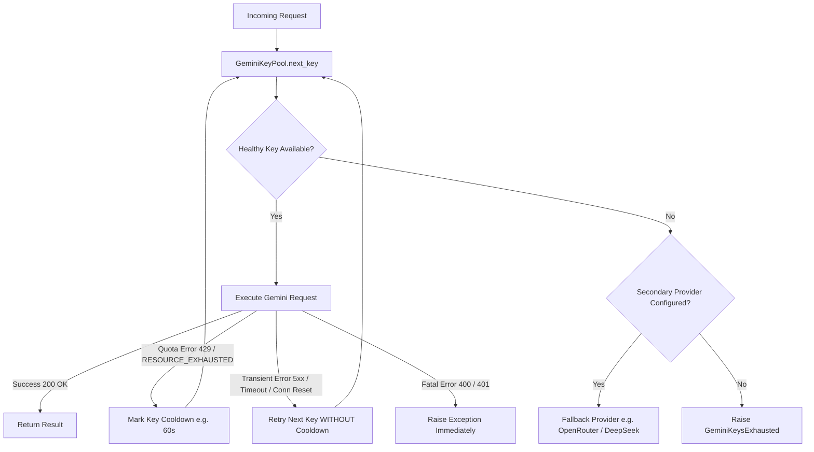

# Gemini API Key Rotation & Quota Management Pattern

A production-proven, zero-leak strategy to rotate Google Gemini API keys dynamically across requests. Prevents `429 RESOURCE_EXHAUSTED` / out-of-quota errors, handles transient infrastructure failures, supports streaming & structured outputs, and seamlessly integrates with LangChain/LangGraph pipelines.

---

## 1. System Architecture & Lifecycle



### Key Lifecycle Principles
1. **Thread-Safe Round-Robin Selection**: Keys are selected sequentially using `time.monotonic()` to ensure fair distribution across concurrent threads.
2. **Quota Cooldown Tracking**: When a key returns `429 Rate Limit` or `RESOURCE_EXHAUSTED`, it is placed on temporary cooldown (e.g., 60s). Subsequent requests skip cooling keys until their cooldown expires.
3. **Transient Failure Recovery**: Server-side errors (500, 503, Gateway Timeout, Connection Reset) retry on the next key **without** marking quota cooldown, preventing pool starvation during temporary Google outages.
4. **Dynamic Key Discovery**: Automatically discovers keys from environment variables using a standardized naming convention: `GEMINI_API_KEY`, `GEMINI_API_FALLBACK_KEY`, `GEMINI_API_FALLBACK_KEY2`, `GEMINI_API_FALLBACK_KEY3`, etc.
5. **Credential Security**: Raw API key strings are encapsulated inside opaque `GeminiKeyLease` containers and never printed to logs or error tracebacks.

---

## 2. Core Implementation: Key Pool (`gemini_key_pool.py`)

This standalone module requires **only standard library Python modules** (`re`, `time`, `dataclasses`, `threading`, `typing`).

```python
"""Concurrency-safe discovery and health tracking for Gemini API keys."""

from __future__ import annotations

import re
import time
from dataclasses import dataclass
from threading import Lock
from typing import Callable, Mapping, TypeVar

_NUMBERED_FALLBACK_KEY = re.compile(r"^GEMINI_API_FALLBACK_KEY([1-9][0-9]*)$")
T = TypeVar("T")


class GeminiKeysExhausted(RuntimeError):
    """Raised when no configured Gemini API key is currently eligible."""


@dataclass(frozen=True)
class GeminiKeyLease:
    """Opaque key lease container. Callers MUST NEVER log or print ``api_key``."""

    position: int
    api_key: str


class GeminiKeyPool:
    """Select configured Gemini keys in healthy round-robin order."""

    def __init__(
        self,
        keys: list[str],
        *,
        clock: Callable[[], float] = time.monotonic,
        cooldown_seconds: float = 60.0,
    ) -> None:
        self._keys = keys
        self._clock = clock
        self._cooldown_seconds = cooldown_seconds
        self._cooldowns = [0.0] * len(keys)
        self._cursor = 0
        self._lock = Lock()

    @classmethod
    def from_environment(
        cls,
        environment: Mapping[str, str],
        *,
        clock: Callable[[], float] = time.monotonic,
        cooldown_seconds: float = 60.0,
    ) -> GeminiKeyPool:
        """Build a pool from environment variable names.
        
        Supported variable patterns:
        - GEMINI_API_KEY (Primary)
        - GEMINI_API_FALLBACK_KEY (Default fallback)
        - GEMINI_API_FALLBACK_KEY2, GEMINI_API_FALLBACK_KEY3, ... (Numbered fallbacks)
        """
        names = ["GEMINI_API_KEY", "GEMINI_API_FALLBACK_KEY"]
        numbered: list[tuple[int, str]] = []
        for name in environment:
            match = _NUMBERED_FALLBACK_KEY.fullmatch(name)
            if match:
                numbered.append((int(match.group(1)), name))
        names.extend(name for _, name in sorted(numbered))

        seen: set[str] = set()
        keys: list[str] = []
        for name in names:
            value = environment.get(name, "").strip()
            if value and value not in seen:
                seen.add(value)
                keys.append(value)
        return cls(keys, clock=clock, cooldown_seconds=cooldown_seconds)

    @property
    def key_count(self) -> int:
        """Return total number of unique configured keys."""
        return len(self._keys)

    def next_key(self) -> GeminiKeyLease:
        """Return the next healthy key and advance the cursor atomically."""
        with self._lock:
            now = self._clock()
            for offset in range(len(self._keys)):
                position = (self._cursor + offset) % len(self._keys)
                if self._cooldowns[position] <= now:
                    self._cursor = (position + 1) % len(self._keys)
                    return GeminiKeyLease(position, self._keys[position])
        raise GeminiKeysExhausted("No configured Gemini API key is currently available.")

    def mark_quota_limited(
        self, lease: GeminiKeyLease, *, cooldown_seconds: float | None = None
    ) -> None:
        """Temporarily place one key on cooldown."""
        duration = cooldown_seconds or self._cooldown_seconds
        with self._lock:
            self._cooldowns[lease.position] = self._clock() + duration

    def invoke(
        self,
        operation: Callable[[GeminiKeyLease], T],
        *,
        is_quota_limited: Callable[[Exception], bool],
    ) -> T:
        """Execute an operation, trying healthy keys sequentially if quota limited."""
        last_quota_error: Exception | None = None
        for _ in range(self.key_count):
            try:
                lease = self.next_key()
            except GeminiKeysExhausted:
                if last_quota_error is not None:
                    raise last_quota_error
                raise
            try:
                return operation(lease)
            except Exception as exc:
                if not is_quota_limited(exc):
                    raise
                self.mark_quota_limited(lease)
                last_quota_error = exc
        if last_quota_error is not None:
            raise last_quota_error
        raise GeminiKeysExhausted("No configured Gemini API key is currently available.")
```

---

## 3. LangChain / Runnable Integration (`llm_rotation.py`)

Integrates `GeminiKeyPool` into LangChain pipelines as a native `Runnable`.

```python
"""Quota-aware Gemini model rotation wrapper for LangChain / LangGraph."""

import logging
from collections.abc import Callable, Iterator
from typing import Any

from langchain_core.runnables import Runnable
from langchain_google_genai import ChatGoogleGenerativeAI
from pydantic import BaseModel

from gemini_key_pool import GeminiKeyPool, GeminiKeysExhausted

logger = logging.getLogger(__name__)


def is_gemini_quota_error(exc: Exception) -> bool:
    """Return True only for genuine per-key quota / rate-limit signals."""
    text = str(exc).casefold()
    return any(
        marker in text
        for marker in (
            "429",
            "quota",
            "rate limit",
            "rate_limit",
            "resource exhausted",
            "resource_exhausted",
        )
    )


def is_gemini_transient_error(exc: Exception) -> bool:
    """Return True for server-side transient errors warranting a key retry WITHOUT cooldown."""
    text = str(exc).casefold()
    return any(
        marker in text
        for marker in (
            "500",
            "503",
            "504",
            "deadline",
            "timeout",
            "unavailable",
            "connection error",
            "connection reset",
            "connection refused",
            "remotedisconnected",
        )
    )


class GeminiRotatingRunnable(Runnable[Any, Any]):
    """Invoke LLM operations per healthy Gemini key in pool without logging credentials."""

    def __init__(
        self,
        pool: GeminiKeyPool,
        model_factory: Callable[[str], Any],
        fallback_factory: Callable[[], Any] | None = None,
    ) -> None:
        self._pool = pool
        self._model_factory = model_factory
        self._fallback_factory = fallback_factory

    def invoke(self, value: Any, config: Any = None, **kwargs: Any) -> Any:
        """Synchronously invoke LLM with automatic key failover."""
        last_transient_error: Exception | None = None
        for _ in range(self._pool.key_count):
            try:
                return self._pool.invoke(
                    lambda lease: self._model_factory(lease.api_key).invoke(
                        value, config=config, **kwargs
                    ),
                    is_quota_limited=is_gemini_quota_error,
                )
            except GeminiKeysExhausted:
                break
            except Exception as exc:
                if is_gemini_transient_error(exc):
                    logger.warning(
                        "Gemini transient error, retrying next key: %s", type(exc).__name__
                    )
                    last_transient_error = exc
                    continue
                raise

        # All Gemini keys exhausted or failed transiently — attempt secondary provider
        if self._fallback_factory:
            logger.warning("All Gemini keys exhausted. Triggering fallback provider.")
            return self._fallback_factory().invoke(value, config=config, **kwargs)

        if last_transient_error is not None:
            raise last_transient_error
        raise GeminiKeysExhausted("No configured Gemini API key is currently available.")

    def stream(self, value: Any, config: Any = None, **kwargs: Any) -> Iterator[Any]:
        """Stream chunks with failover prior to yielding the first chunk."""
        last_error: Exception | None = None
        for _ in range(self._pool.key_count):
            try:
                lease = self._pool.next_key()
            except GeminiKeysExhausted as exc:
                if self._fallback_factory:
                    logger.warning("Gemini keys exhausted. Triggering fallback stream.")
                    yield from self._fallback_factory().stream(value, config=config, **kwargs)
                    return
                if last_error is not None:
                    raise last_error
                raise exc

            emitted = False
            try:
                for chunk in self._model_factory(lease.api_key).stream(
                    value, config=config, **kwargs
                ):
                    emitted = True
                    yield chunk
                return
            except Exception as exc:
                if emitted:
                    # Stream partially delivered — surface error immediately
                    raise
                if is_gemini_quota_error(exc):
                    self._pool.mark_quota_limited(lease)
                    last_error = exc
                elif is_gemini_transient_error(exc):
                    logger.warning("Gemini transient error during stream, retrying: %s", type(exc).__name__)
                    last_error = exc
                else:
                    raise

        if self._fallback_factory:
            logger.warning("All Gemini keys exhausted. Triggering fallback stream.")
            yield from self._fallback_factory().stream(value, config=config, **kwargs)
            return

        if last_error is not None:
            raise last_error
        raise GeminiKeysExhausted("No configured Gemini API key is currently available.")
```

---

## 4. Configuration & Setup (`.env`)

Configure multiple Google AI Studio API keys in your `.env` file:

```env
# Primary API Key
GEMINI_API_KEY="AIzaSyA1..."

# Default Fallback Key
GEMINI_API_FALLBACK_KEY="AIzaSyB2..."

# Additional Numbered Fallback Keys (Discovered automatically)
GEMINI_API_FALLBACK_KEY2="AIzaSyC3..."
GEMINI_API_FALLBACK_KEY3="AIzaSyD4..."
GEMINI_API_FALLBACK_KEY4="AIzaSyE5..."

# Cooldown duration in seconds when 429 occurs (Default: 60)
GEMINI_KEY_COOLDOWN_SECONDS=60
```

---

## 5. Usage Patterns & Integration Examples

### Example A: Basic Runnable Factory
```python
import os
from dotenv import load_dotenv
from gemini_key_pool import GeminiKeyPool
from llm_rotation import GeminiRotatingRunnable
from langchain_google_genai import ChatGoogleGenerativeAI

load_dotenv()

pool = GeminiKeyPool.from_environment(os.environ, cooldown_seconds=60)

def get_rotating_llm(model: str = "gemini-3.5-flash-lite", temperature: float = 0.7):
    return GeminiRotatingRunnable(
        pool=pool,
        model_factory=lambda api_key: ChatGoogleGenerativeAI(
            model=model,
            google_api_key=api_key,
            temperature=temperature,
        )
    )

# Invoke
llm = get_rotating_llm()
response = llm.invoke("Explain API key rotation in one sentence.")
print(response.content)
```

### Example B: Structured Output with Pydantic
```python
from pydantic import BaseModel, Field

class AnalysisReport(BaseModel):
    summary: str = Field(description="Executive summary of the issue")
    risk_level: str = Field(description="Low, Medium, or High")

def get_structured_rotating_llm(schema: type[BaseModel], model: str = "gemini-3.5-flash-lite"):
    return GeminiRotatingRunnable(
        pool=pool,
        model_factory=lambda api_key: ChatGoogleGenerativeAI(
            model=model,
            google_api_key=api_key,
        ).with_structured_output(schema)
    )

chain = get_structured_rotating_llm(AnalysisReport)
report = chain.invoke("Analyze out-of-quota error 429")
print(f"Risk: {report.risk_level} | Summary: {report.summary}")
```

### Example C: LangChain Chain Composition (`Prompt | LLM | Parser`)
```python
from langchain_core.prompts import ChatPromptTemplate
from langchain_core.output_parsers import StrOutputParser

prompt = ChatPromptTemplate.from_messages([
    ("system", "You are an expert cloud architect."),
    ("user", "{topic}")
])

chain = prompt | get_rotating_llm() | StrOutputParser()
result = chain.invoke({"topic": "High availability rate limiting"})
print(result)
```

---

## 6. Pytest Verification Suite Template (`test_key_rotation.py`)

Include this test file in your project to verify key rotation and failover mechanics:

```python
import pytest
from gemini_key_pool import GeminiKeyPool, GeminiKeysExhausted
from llm_rotation import GeminiRotatingRunnable

def test_round_robin_key_rotation():
    pool = GeminiKeyPool.from_environment({
        "GEMINI_API_KEY": "key-1",
        "GEMINI_API_FALLBACK_KEY": "key-2",
        "GEMINI_API_FALLBACK_KEY2": "key-3",
    })
    leases = [pool.next_key().api_key for _ in range(4)]
    assert leases == ["key-1", "key-2", "key-3", "key-1"]

def test_quota_cooldown_failover():
    now = [100.0]
    pool = GeminiKeyPool.from_environment(
        {"GEMINI_API_KEY": "key-1", "GEMINI_API_FALLBACK_KEY": "key-2"},
        clock=lambda: now[0],
        cooldown_seconds=60,
    )
    first = pool.next_key()
    pool.mark_quota_limited(first)
    
    # Should skip key-1 and return key-2
    assert pool.next_key().api_key == "key-2"
    
    # Advance clock past cooldown -> key-1 is healthy again
    now[0] += 61.0
    assert pool.next_key().api_key == "key-1"

def test_runnable_automatically_retries_next_key_on_429():
    pool = GeminiKeyPool.from_environment({
        "GEMINI_API_KEY": "key-1",
        "GEMINI_API_FALLBACK_KEY": "key-2",
    })
    used_keys = []

    class MockModel:
        def __init__(self, api_key: str):
            self.api_key = api_key

        def invoke(self, prompt, **kwargs):
            used_keys.append(self.api_key)
            if self.api_key == "key-1":
                raise RuntimeError("429 RESOURCE_EXHAUSTED: Rate limit exceeded")
            return "Success response"

    runnable = GeminiRotatingRunnable(pool, lambda key: MockModel(key))
    result = runnable.invoke("Test prompt")
    
    assert result == "Success response"
    assert used_keys == ["key-1", "key-2"]

def test_all_keys_exhausted_raises_exception():
    pool = GeminiKeyPool.from_environment({"GEMINI_API_KEY": "key-1"})
    pool.mark_quota_limited(pool.next_key())
    
    with pytest.raises(GeminiKeysExhausted):
        pool.next_key()
```

---

## 7. Best Practices & Operational Recommendations

1. **Obtain Multiple AI Studio Keys**: Create 3–5 free Gemini API keys across separate Google AI Studio workspace projects to maximize free-tier throughput (e.g., 15 RPM / 1M TPM per key).
2. **Set Optimal Cooldown Duration**:
   - For RPM (Requests Per Minute) limits, set `GEMINI_KEY_COOLDOWN_SECONDS=60`.
   - For RPD (Requests Per Day) quota exhaustion, set a longer cooldown or use a secondary provider fallback (OpenRouter/DeepSeek).
3. **Never Log Key Credentials**: Use `GeminiKeyLease` object properties inside system bounds and sanitize output logs.
4. **Monitor Pool Health**: Log warnings on failover events to detect when multiple keys hit quota limits simultaneously.
