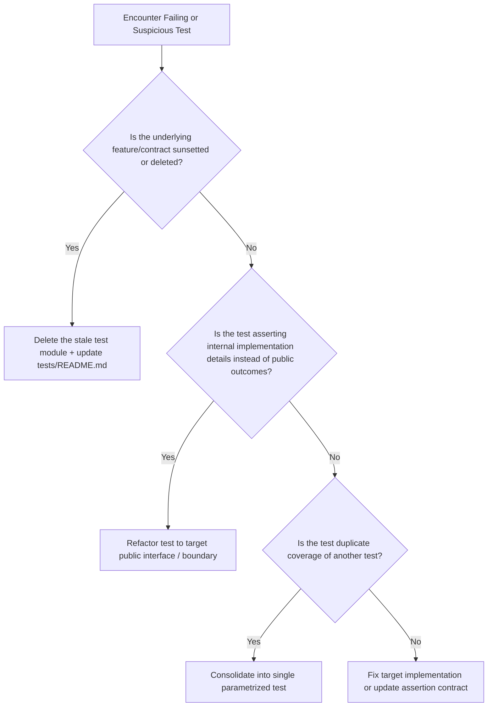

# Handoff: Test Suite Management, Scaling, and Stale Test Pruning

**Date**: August 5, 2026  
**Context**: Following the successful reorganization of `tests/` into `unit/`, `component/`, and `support/`, this document provides architectural strategies, workflows, and guidelines for managing test suite bloat and stale test files as the codebase grows.

---

## 1. Executive Summary

As a codebase expands, test suites often face two major failure modes:
1. **Test Suite Bloat**: Amassing hundreds of duplicate, overlapping, or slow tests that degrade CI speed.
2. **Stale / Orphaned Tests**: Tests that assert outdated contracts, test deleted internal implementations, or use obsolete mocks—causing confusion for both humans and Coding Agents.

This handoff outlines a systematic methodology to detect, prune, refactor, and maintain tests using clean boundaries and automated checks.

---

## 2. Core Problem Breakdown

| Problem | Root Cause | Impact |
| :--- | :--- | :--- |
| **Orphaned Tests** | Production logic was refactored or deleted, but its corresponding unit test file remained. | Wasted execution time, false sense of security, cognitive load when searching `tests/`. |
| **Mock Bit Rot** | Heavy mocking of internal implementation details rather than public interfaces. | Mocks pass even when underlying contracts break, or fail on harmless refactors. |
| **Duplicate Coverage** | Multiple tests asserting the exact same behavior with minor variations. | Bloated suite, slower test runs, maintenance burden when requirements change. |
| **Superficial Testing** | Tests asserting `assert x is not None` instead of verifying exact mathematical or domain contracts. | Low assertion quality, hiding silent bugs. |

---

## 3. Systematic Strategies for Test Suite Management

### Strategy 1: Enforce Strict Source-to-Test Ownership
Maintain the canonical mapping in [`tests/README.md`](file:///E:/VIN-INTERNSHIP/Cowork-RAG/tests/README.md):
```text
src/domain/**        → tests/unit/domain/**
src/ingestion/**     → tests/unit/ingestion/**
src/generation/**    → tests/unit/generation/**
src/api/**           → tests/component/api/**
```
- **Rule**: Every test file in `tests/unit/` MUST mirror a specific module in `src/`. If a module under `src/` is deleted, its matching test file in `tests/` MUST be deleted in the same commit.

### Strategy 2: Stale Test Detection Workflow

Use a 3-step audit process to surface stale or orphaned tests:

1. **Symbol & Import Audit (`vulture` / `grep_search`)**:
   - Search for references to tested functions across `tests/`.
   - If a test file imports a function/class that no longer exists in `src/`, mark the test file for cleanup.

2. **Git History vs. Test Recency**:
   - Find test files that haven't been touched while their target `src/` modules underwent major refactors.
   ```bash
   git log --name-status --since="3 months ago" -- tests/
   ```

3. **Coverage & Mutation Auditing (`pytest-cov` & `mutmut`)**:
   - Check if a test file can be removed without dropping line coverage or breaking any domain contracts.
   - Use `uv run pytest --cov=src --cov-report=term-missing` to inspect covered vs. uncovered lines.

### Strategy 3: Disciplined Test Pruning Lifecycle

When encountering a suspicious or failing test, follow this workflow:



> [!IMPORTANT]
> **Anti-Pattern Warning**: Never delete a failing test merely to make CI pass. Only delete a test if the feature contract it validates has been explicitly deprecated or replaced.

### Strategy 4: Parametrization & Shared Builders
To avoid creating new `.py` files for every edge case:
1. **Parametrize test cases**: Combine related input/output checks into `@pytest.mark.parametrize`.
2. **Use Shared Builders**: Import `make_chunk` from [`tests/support/builders.py`](file:///E:/VIN-INTERNSHIP/Cowork-RAG/tests/support/builders.py) instead of re-specifying 10 Pydantic fields in every test file.
3. **Use Shared Provider Fakes**: Use `CitedProvider`, `UncitedProvider`, etc., from [`tests/support/providers.py`](file:///E:/VIN-INTERNSHIP/Cowork-RAG/tests/support/providers.py) to prevent inline duplicate mock classes.

---

## 4. Coding Agent Rules for Test Hygiene (Enforced in [`AGENTS.md`](file:///E:/VIN-INTERNSHIP/Cowork-RAG/AGENTS.md))

1. **Check Before Creating**: Read `tests/README.md` and search for existing tests before creating a new test file.
2. **Document Intent**: Add a concise comment above test functions explaining the exact behavior/contract being proved.
3. **Clean Up on Delete**: When removing or refactoring a `src/` feature, search and delete orphaned test files immediately.
4. **No Blanket Mocks**: Mock external system boundaries (Gemini, Jina, OpenAI, Qdrant Cloud), never internal domain helpers.

---

## 5. Next Session Discussion Questions

When exploring test suite optimization in your next session, consider:
- **Coverage vs. Speed Tradeoffs**: What is the target CI execution time budget (e.g., < 30s)?
- **Parametrization Candidates**: Which test files can be consolidated into single parametrized suites?
- **Automated Dead-Test Detection**: Should we add `vulture` or `pytest-deadfixtures` to our pre-commit checks?
