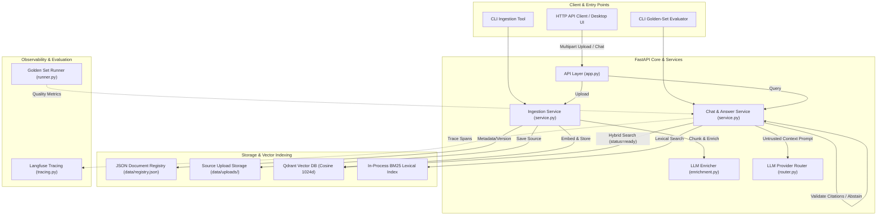
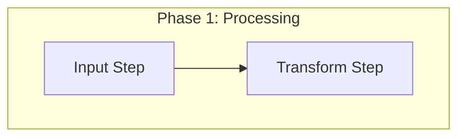

# RAG Architecture Overhaul & Agent Standards Implementation Plan

> **For agentic workers:** REQUIRED SUB-SKILL: Use superpowers:subagent-driven-development (recommended) or superpowers:executing-plans to implement this plan task-by-task. Steps use checkbox (`- [ ]`) syntax for tracking.

**Goal:** Rename `ARCHITECTURE.md` to `RAG-ARCHITECTURE.md` containing a RAG Phase Key Decisions Matrix, update repo references, and create `docs/architectures/README.md` as a documentation index and AI agent formatting standard.

**Architecture:** Restructure root system context around core RAG pipeline phases (Ingestion, Hybrid Retrieval, Provider Routing, Citation Verification, Telemetry) and establish strict formatting/Mermaid guardrails for subfolder documentation.

**Tech Stack:** Markdown, Mermaid.js, Git.

## Global Constraints

- Root architecture file name: `RAG-ARCHITECTURE.md`.
- Documentation index file name: `docs/architectures/README.md`.
- Relative links from `docs/architectures/*.md` to source code must use `../../src/...`.
- Relative links from `docs/architectures/README.md` to root architecture must use `../../RAG-ARCHITECTURE.md`.
- Mermaid diagram labels must be double-quoted with no unescaped brackets or raw `<>` HTML tags.

---

### Task 1: Rename `ARCHITECTURE.md` to `RAG-ARCHITECTURE.md` and Add RAG Phase Key Decisions Matrix

**Files:**
- Create: `RAG-ARCHITECTURE.md`
- Delete: `ARCHITECTURE.md`

**Interfaces:**
- Consumes: [`docs/superpowers/specs/2026-08-04-architecture-doc-standards-design.md`](../../docs/superpowers/specs/2026-08-04-architecture-doc-standards-design.md)
- Produces: `RAG-ARCHITECTURE.md` root system specification file.

- [ ] **Step 1: Write `RAG-ARCHITECTURE.md` containing RAG Phase Key Decisions Matrix**

Create `RAG-ARCHITECTURE.md` with the following content:

```markdown
# Architecture Document: Company Knowledge RAG

## System Overview

Company Knowledge RAG is an enterprise-grade, source-grounded Retrieval-Augmented Generation (RAG) system built with **FastAPI**, **Qdrant**, and **Langfuse**. Operating as a **single-user / open workspace RAG assistant**, it enables users to ingest and query internal documents seamlessly, combining **Dense & Lexical (BM25) Hybrid Search** via Reciprocal Rank Fusion (RRF) and strictly validating LLM responses using **Citation-Gated Abstention**.

> [!NOTE]
> **Fresher AI Engineer Key Takeaway**: In open workspace local RAG systems, user experience and source-grounded accuracy are paramount. By removing multi-tenant authentication barriers, the system provides instant document access while maintaining strict post-generation citation verification to eliminate hallucinations.

---

## Key Architectural Decisions by RAG Phase

The table below outlines the core technical decisions, underlying engineering rationale, and primary implementation modules for each phase of the RAG pipeline.

### Phase 1: Ingestion & Indexing (Offline)
- **1.1 Document Loading & Cleaning**:
  - *Key Decision*: Standardize multi-format parsing (PDF, Markdown, Text) with Unicode NFC normalization and status tracking (`ready`, `needs_ocr`, `failed`).
  - *Rationale*: Eliminates text noise to prevent downstream retrieval degradation.
  - *Primary File*: [`src/ingestion/parser.py`](src/ingestion/parser.py)
- **1.2 Chunking Strategy**:
  - *Key Decision*: Section-aware recursive character chunking (~1,200 chars with 10–20% overlap).
  - *Rationale*: Preserves natural paragraph boundaries while preventing context truncation at chunk seams.
  - *Primary File*: [`src/ingestion/chunker.py`](src/ingestion/chunker.py)
- **1.3 Contextual Enrichment (Optional)**:
  - *Key Decision*: Prepend LLM-generated summaries and hypothetical questions to retrieval text.
  - *Rationale*: Enhances recall for high-level thematic queries that lack direct keyword matches.
  - *Primary File*: [`src/ingestion/enrichment.py`](src/ingestion/enrichment.py)
- **1.4 Vector & Storage Engine**:
  - *Key Decision*: Decoupled Qdrant Vector DB (Cosine 1024d, Gemini embeddings), JSON Registry (`data/registry.json`), and Raw Source Retention (`data/uploads/`).
  - *Rationale*: Enables instant reindexing without re-uploading bytes and restricts vector queries to ready files.
  - *Primary Files*: [`src/storage/registry.py`](src/storage/registry.py), [`src/retrieval/qdrant_store.py`](src/retrieval/qdrant_store.py)

### Phase 2: Query & Retrieval (Runtime)
- **2.1 Hybrid Retrieval Strategy**:
  - *Key Decision*: Parallel Qdrant Dense Search + In-process BM25 Lexical Search fused via **Reciprocal Rank Fusion (RRF k=60)**.
  - *Rationale*: Overcomes the "hard ceiling" of vector-only search by capturing exact keywords, names, and IDs via BM25 alongside semantic vectors.
  - *Primary File*: [`src/retrieval/hybrid.py`](src/retrieval/hybrid.py)
- **2.2 Score Thresholding**:
  - *Key Decision*: `min_dense_score` gating before prompt rendering.
  - *Rationale*: Filters out low-relevance noise to save tokens and improve answer quality.
  - *Primary File*: [`src/generation/service.py`](src/generation/service.py)

### Phase 3: Generation & LLM Routing (Runtime)
- **3.1 Prompt Context Isolation**:
  - *Key Decision*: Untrusted context blocks (`<context>` tags) in system prompt (`answer_v1.py`).
  - *Rationale*: Protects against prompt injection from ingested document text.
  - *Primary File*: [`src/prompts/answer_v1.py`](src/prompts/answer_v1.py)
- **3.2 Provider Failover Router**:
  - *Key Decision*: Multi-provider LLM Router (Gemini, OpenRouter, OpenAI) with automatic retry fallback.
  - *Rationale*: Prevents service downtime caused by third-party provider outages or rate limits.
  - *Primary File*: [`src/providers/router.py`](src/providers/router.py)

### Phase 4: Safety & Citation Guardrails (Runtime)
- **4.1 Citation Verification & Abstention Guard**:
  - *Key Decision*: Deterministic regex validation of `[C1]`, `[C2]` citation markers; forces automatic abstention (*"Không tìm thấy thông tin phù hợp..."*) if citations are missing or invalid.
  - *Rationale*: Guarantees zero ungrounded hallucinations.
  - *Primary File*: [`src/generation/service.py`](src/generation/service.py)

### Phase 5: Operations & Quality Evaluation
- **5.1 Observability & Telemetry**:
  - *Key Decision*: Langfuse span tracing with configurable privacy modes (`off`, `metadata-only`, `full`).
  - *Primary File*: [`src/observability/tracing.py`](src/observability/tracing.py)
- **5.2 Golden Set Evaluation**:
  - *Key Decision*: Automated CLI runner (`company-rag-evaluate`) against `evaluation/golden_set.json` to catch silent retrieval regressions.
  - *Primary File*: [`src/evaluation/runner.py`](src/evaluation/runner.py)

---

## Architecture Topology



## Core Components Matrix

| Subsystem / Component | Responsibility | Implementation File | Key Interfaces / Schema |
| --- | --- | --- | --- |
| **API Layer** | Exposes open REST endpoints for uploads, chat, document management, health, and OpenAPI docs. | [`src/api/app.py`](src/api/app.py) | `create_app()`, `/v1/documents`, `/v1/chat` |
| **Ingestion Pipeline** | Parses raw documents, manages content hashing, chunks text, and enriches metadata. | [`src/ingestion/service.py`](src/ingestion/service.py) | `IngestionService.ingest_bytes()` |
| **Document Registry** | Stores document metadata, versions, SHA-256 hashes, and processing statuses. | [`src/storage/registry.py`](src/storage/registry.py) | `DocumentRegistry`, `data/registry.json` |
| **Vector & Lexical Store** | Handles vector embedding, Qdrant indexing, status filtering, and BM25 scoring. | [`src/retrieval/qdrant_store.py`](src/retrieval/qdrant_store.py) | `QdrantChunkStore`, `MemoryChunkStore` |
| **Generation Engine** | Constructs prompts, handles provider failovers, calls LLMs, and verifies citations. | [`src/generation/service.py`](src/generation/service.py) | `ChatService.answer()` |
| **Observability** | Emits structured telemetry spans (request, retrieval, generation) to Langfuse. | [`src/observability/tracing.py`](src/observability/tracing.py) | `Tracer`, `TraceMode` |
| **Quality Evaluation** | Automated golden-set runner for testing retrieval, citations, abstention, and latency. | [`src/evaluation/runner.py`](src/evaluation/runner.py) | `company-rag-evaluate` |
```

- [ ] **Step 2: Remove old `ARCHITECTURE.md` file**

Run command to remove old file: `git rm ARCHITECTURE.md` or delete `ARCHITECTURE.md`.

- [ ] **Step 3: Verify `RAG-ARCHITECTURE.md` file existence**

Check: `Test-Path RAG-ARCHITECTURE.md`
Expected: True

- [ ] **Step 4: Commit Task 1**

```bash
git add RAG-ARCHITECTURE.md
git rm ARCHITECTURE.md
git commit -m "docs: rename ARCHITECTURE.md to RAG-ARCHITECTURE.md and add RAG Phase Key Decisions Matrix"
```

---

### Task 2: Create `docs/architectures/README.md` (Directory Index & Agent Formatting Standard)

**Files:**
- Create: `docs/architectures/README.md`

**Interfaces:**
- Consumes: [`RAG-ARCHITECTURE.md`](../../RAG-ARCHITECTURE.md)
- Produces: `docs/architectures/README.md` directory navigation & standard guide.

- [ ] **Step 1: Write `docs/architectures/README.md`**

Create `docs/architectures/README.md` with content:

```markdown
# Architecture Documentation Index & Agent Standard

> **System Overview Reference**: For the overall high-level system architecture overview, see the root [`RAG-ARCHITECTURE.md`](../../RAG-ARCHITECTURE.md). This directory (`docs/architectures/`) contains the deep-dive modular technical specifications.

---

## 1. Modular Architecture Document Index

The table below maps each detailed architecture file to its topic, primary focus, and underlying implementation files:

| File Name | Subsystem / Topic | Key Focus & Capabilities | Primary Implementation Files |
| :--- | :--- | :--- | :--- |
| [`01-system-context.md`](01-system-context.md) | System Context & Topology | High-level system context, entry points, component matrix | [`src/api/app.py`](../../src/api/app.py), [`src/ingestion/service.py`](../../src/ingestion/service.py) |
| [`02-document-loading-and-ingestion.md`](02-document-loading-and-ingestion.md) | Document Ingestion Pipeline | Document parsing, hashing, text cleaning, chunking | [`src/ingestion/service.py`](../../src/ingestion/service.py), [`src/storage/registry.py`](../../src/storage/registry.py) |
| [`03-indexing-storage-and-access-control.md`](03-indexing-storage-and-access-control.md) | Indexing & Storage Layer | Qdrant vector store, status flags (`ready`), persistence | [`src/retrieval/qdrant_store.py`](../../src/retrieval/qdrant_store.py) |
| [`04-retrieval-generation-and-citations.md`](04-retrieval-generation-and-citations.md) | Retrieval & Generation Engine | Hybrid search (RRF), prompt templates, citation gating | [`src/retrieval/hybrid.py`](../../src/retrieval/hybrid.py), [`src/generation/service.py`](../../src/generation/service.py) |
| [`05-observability-evaluation-and-operations.md`](05-observability-evaluation-and-operations.md) | Operations & Observability | Langfuse telemetry tracing, golden set benchmark runner | [`src/observability/tracing.py`](../../src/observability/tracing.py), [`src/evaluation/runner.py`](../../src/evaluation/runner.py) |
| [`06-simple-rag-vs-company-rag-comparison.md`](06-simple-rag-vs-company-rag-comparison.md) | RAG Pipeline Comparison | Baseline vs. Production RAG side-by-side comparison | All core pipeline files |

---

## 2. Formatting & Structural Standard for Coding Agents

When creating or modifying documentation files in this directory, AI coding agents and human contributors MUST strictly follow these formatting rules:

### 2.1 File Naming Convention
- Files MUST follow the pattern: `NN-<topic-in-kebab-case>.md` (e.g., `07-new-feature-topic.md`).

### 2.2 Section Structure Hierarchy
Every document MUST contain the following sections in exact order:
1. `# <Descriptive Title>` (H1 heading at top).
2. `## Fresher AI Engineer Key Concepts` (H2 heading containing a GitHub alert `> [!NOTE]` explaining domain terminology simply).
3. `## Overview` or `## Purpose` (H2 summary of subsystem goals).
4. `## Component Matrix` or `## Detailed Workflow Steps` (H2 Markdown table linking code files and key interfaces).
5. `## Pipeline Architecture` or `## Diagram` (H2 Mermaid diagram visualizing data flow or topology).

### 2.3 Mermaid Syntax Guardrails
To prevent diagram rendering failures in IDEs and browsers:
- **Always double-quote node labels**: Use `Node["Text"]` or `Decision{"Text"}`.
- **Do NOT use unescaped brackets in decision nodes**:
  - ❌ `C_Verify{Regex Check [C1], [C2]}` → **Syntax Error!**
  - ✅ `C_Verify{"Regex Check (C1, C2)"}` → **Valid!**
- **Do NOT use unescaped HTML tags**: Replace `<context>` with `Context` or use `&lt;context&gt;`.
- **Do NOT use ampersands as word joiners**: Use `and` instead of `&` to prevent junction parsing errors.
- **Use Subgraph Phase Boxes**: Enclose multi-stage workflows in `subgraph Phase1["Phase 1: Title"]`.

### 2.4 Code Linking Standard
- File links MUST use relative paths pointing to `../../src/...`:
  - Example: [`src/generation/service.py`](../../src/generation/service.py)
- Symbols MUST use inline backticks: `IngestionService.ingest_bytes()`, `status == "ready"`.

---

## 3. Copy-Paste Starter Skeleton Template

When authoring a new document (e.g., `07-topic-name.md`), copy and populate the template below:

```markdown
# [Subsystem Name] Architecture

## Fresher AI Engineer Key Concepts

> [!NOTE]
> **What is [Concept Name]?**  
> Explain the core domain concept simply in 2-3 sentences here.

## Purpose & Overview

Describe what this subsystem does, why it exists, and its core operational behavior.

## Component Matrix

| Subsystem / Module | Responsibility | Implementation File | Key Interfaces |
| :--- | :--- | :--- | :--- |
| **Component Name** | Description | [`src/path/file.py`](../../src/path/file.py) | `ClassName.method()` |

## Pipeline Architecture


```
```

- [ ] **Step 2: Verify `docs/architectures/README.md` file existence**

Check: `Test-Path docs/architectures/README.md`
Expected: True

- [ ] **Step 3: Commit Task 2**

```bash
git add docs/architectures/README.md
git commit -m "docs: add docs/architectures/README.md index and AI agent formatting standard"
```

---

### Task 3: Update Repository References to `RAG-ARCHITECTURE.md`

**Files:**
- Modify: `README.md:1-120`
- Modify: `docs/architectures/01-system-context.md` (if referencing root `ARCHITECTURE.md`)

**Interfaces:**
- Consumes: `RAG-ARCHITECTURE.md`
- Produces: Repo files updated with working links to `RAG-ARCHITECTURE.md`.

- [ ] **Step 1: Check for existing `ARCHITECTURE.md` references in codebase**

Run: `git grep "ARCHITECTURE.md"`
Expected: Matches in `README.md` or docs.

- [ ] **Step 2: Update references in `README.md` and docs**

Replace `ARCHITECTURE.md` with `RAG-ARCHITECTURE.md` in all occurrences.

- [ ] **Step 3: Verify no broken `ARCHITECTURE.md` links remain**

Run: `git grep "ARCHITECTURE.md"`
Expected: 0 matches (or only in design specs/historical commits).

- [ ] **Step 4: Commit Task 3**

```bash
git add README.md docs/
git commit -m "docs: update repository links from ARCHITECTURE.md to RAG-ARCHITECTURE.md"
```
