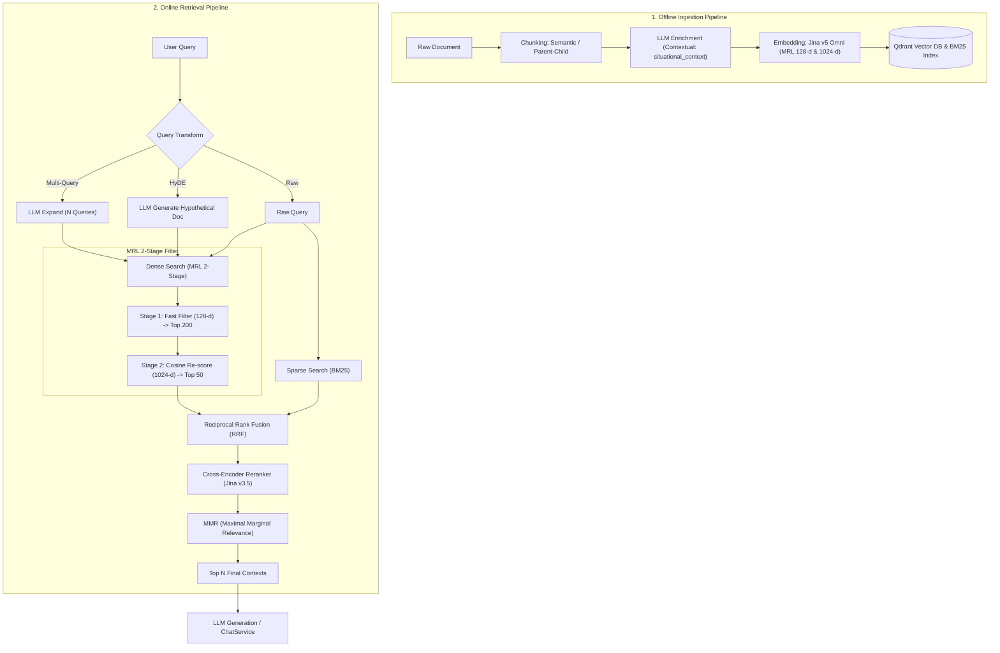

# Advanced Retrieval Workflow

## Chi tiết luồng thực thi

### A. Ingestion (Index time)
1. **Chunking**: Semantic / Parent-Child chia nhỏ văn bản.
2. **Contextual Enrichment**: [`src/ingestion/enrichment.py`](file:///D:/User/ProjectGithub/hiepnguyenn-99/Company-knowledge-RAG/src/ingestion/enrichment.py) thêm `situational_context` định vị điều/khoản/tên văn bản vào chunk.
3. **MRL Indexing**: Embed 1024-d, lưu payload phục vụ tra cứu.

### B. Search & Retrieval (Query time)
1. **Query Transformation**: [`src/retrieval/query_transform.py`](file:///D:/User/ProjectGithub/hiepnguyenn-99/Company-knowledge-RAG/src/retrieval/query_transform.py) Multi-Query hoặc HyDE.
2. **Two-Stage Hybrid Search**: [`src/retrieval/qdrant_store.py`](file:///D:/User/ProjectGithub/hiepnguyenn-99/Company-knowledge-RAG/src/retrieval/qdrant_store.py) (MRL Fast 128-d -> MRL Precise 1024-d + BM25).
3. **Fusion & Reranking**: [`src/retrieval/hybrid.py`](file:///D:/User/ProjectGithub/hiepnguyenn-99/Company-knowledge-RAG/src/retrieval/hybrid.py) (RRF -> Jina Reranker v3.5 -> MMR).
4. **Generation**: [`src/generation/service.py`](file:///D:/User/ProjectGithub/hiepnguyenn-99/Company-knowledge-RAG/src/generation/service.py) tổng hợp ngữ cảnh và trả lời.
